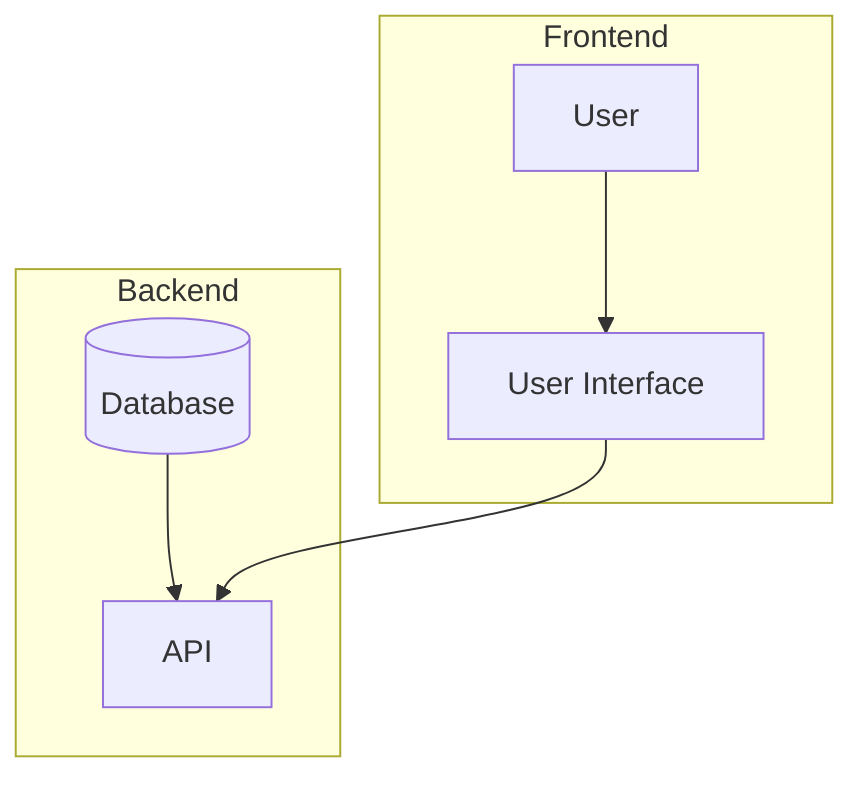

## Mermaid Syntax

Mermaid provides a simple, text-based way to generate diagrams. Below is a detailed syntax guide covering all its features, with examples for each diagram type.

---

### **1. Basic Syntax**
- **Diagram Declaration**: Use a keyword to define the diagram type.
  ```mermaid
  diagram_type;
  ```
  ```txt
  diagram_type;
  ```
- **Comment**: Add comments using `%%`.
  ```mermaid
  %% This is a comment
  ```
  ```txt
  %% This is a comment
  ```

---

### **2. Diagram Types**

#### **a. Flowcharts**
- **Used for**: Process flows and decision trees.
- **Syntax**:
  ```mermaid
  graph [Direction];
  A[Start] --> B[Process];
  B --> C{Decision};
  C -->|Yes| D[Result 1];
  C -->|No| E[Result 2];
  ```
  ```txt
  graph [Direction];
  A[Start] --> B[Process];
  B --> C{Decision};
  C -->|Yes| D[Result 1];
  C -->|No| E[Result 2];
  ```
- **Direction Options**:
  - `TD` (Top-Down)
  - `LR` (Left-Right)
  - `BT` (Bottom-Top)
  - `RL` (Right-Left)
- **Arrow Styles**:
  - `-->` (Standard arrow)
  - `-.->` (Dashed arrow)
  - `==>` (Thick arrow)
  - `---` (No arrow)

---

#### **b. Sequence Diagrams**
- **Used for**: Interaction flows between participants over time.
- **Syntax**:
  ```mermaid
  sequenceDiagram;
  participant A as User;
  participant B as System;
  A->>B: Request Data;
  B-->>A: Response Data;
  A->>B: Another Request;
  ```
  ```txt
  sequenceDiagram;
  participant A as User;
  participant B as System;
  A->>B: Request Data;
  B-->>A: Response Data;
  A->>B: Another Request;
  ```
- **Key Components**:
  - `participant`: Defines entities.
  - `->>`: Solid arrow for messages.
  - `-->>`: Dashed arrow for responses.
  - `Note`:
    ```mermaid
    Note over A: User sends a request;
    ```
    ```txt
    Note over A: User sends a request;
    ```

---

#### **c. Class Diagrams**
- **Used for**: Object-oriented design and relationships.
- **Syntax**:
  ```mermaid
  classDiagram;
  class Person {
      +String name;
      +int age;
      +void display();
  }
  Person <|-- Student: Inherits;
  Person *-- Address: Aggregates;
  ```
  ```txt
  classDiagram;
  class Person {
      +String name;
      +int age;
      +void display();
  }
  Person <|-- Student: Inherits;
  Person *-- Address: Aggregates;
  ```
- **Relationship Types**:
  - `<|--`: Inheritance
  - `*--`: Composition
  - `o--`: Aggregation
  - `..`: Dependency

---

#### **d. Gantt Charts**
- **Used for**: Timelines and task scheduling.
- **Syntax**:
  ```mermaid
  gantt;
  title Project Timeline;
  section Development;
  Task 1 :a1, 2024-01-01, 10d;
  Task 2 :after a1, 5d;
  ```
  ```txt
  gantt;
  title Project Timeline;
  section Development;
  Task 1 :a1, 2024-01-01, 10d;
  Task 2 :after a1, 5d;
  ```
- **Key Components**:
  - `section`: Groups tasks.
  - Task format: `[Name] :[ID], [Start Date], [Duration]`.

---

#### **e. Pie Charts**
- **Used for**: Data distribution.
- **Syntax**:
  ```mermaid
  pie;
  title Browser Market Share;
  "Chrome" : 65;
  "Firefox" : 20;
  "Edge" : 10;
  ```
  ```txt
  pie;
  title Browser Market Share;
  "Chrome" : 65;
  "Firefox" : 20;
  "Edge" : 10;
  ```

---

#### **f. Entity-Relationship (ER) Diagrams**
- **Used for**: Database schemas.
- **Syntax**:
  ```mermaid
  erDiagram;
  CUSTOMER {
      string name;
      string email;
  }
  ORDER {
      int id;
      date order_date;
  }
  CUSTOMER ||--o{ ORDER: places;
  ```
  ```txt
  erDiagram;
  CUSTOMER {
      string name;
      string email;
  }
  ORDER {
      int id;
      date order_date;
  }
  CUSTOMER ||--o{ ORDER: places;
  ```
- **Key Components**:
  - Entity definition: `[EntityName] { [Type] [Attribute] }`
  - Relationships:
    - `||--o{`: One-to-Many
    - `|o--o|`: One-to-One
    - `}o--o{`: Many-to-Many

---

#### **g. State Diagrams**
- **Used for**: Finite-state machines.
- **Syntax**:
  ```mermaid
  stateDiagram-v2;
  [*] --> Start;
  Start --> Processing;
  Processing --> [*];
  Processing --> Error: Validation Failed;
  ```
  ```txt
  stateDiagram-v2;
  [*] --> Start;
  Start --> Processing;
  Processing --> [*];
  Processing --> Error: Validation Failed;
  ```
- **Transitions**:
  - `[Label] --> [Target]`.
  - Add labels for conditions.

---

#### **h. Mindmaps**
- **Used for**: Hierarchical structures and brainstorming.
- **Syntax**:
  ```mermaid
  mindmap;
  root
      child1
          grandchild1
          grandchild2
      child2
          grandchild3
  ```
  ```txt
  mindmap;
  root
      child1
          grandchild1
          grandchild2
      child2
          grandchild3
  ```

---

### **3. Styling and Customization**
- **CSS Classes**: Apply styles to nodes.
  ```txt
  graph TD;
  A[Start]:::customStyle;
  classDef customStyle fill:#f9f,stroke:#333,stroke-width:4px;
  ```

  ```mermaid
  graph TD;
  A[Start]:::customStyle;
  classDef customStyle fill:#f9f,stroke:#333,stroke-width:4px;
  ```
- **Themes**: Change diagram appearance using themes.
  ```txt
  %%{ init: { "theme": "dark" } }%%
  ```

  ```mermaid
  %%{ init: { "theme": "dark" } }%%
  ```

---

### **4. Advanced Features**
- **Subgraphs**: Group nodes into clusters.
  ```txt
  graph TD;
  subgraph Cluster;
      A --> B;
  end;
  ```

  ```mermaid
  graph TD;
  subgraph Cluster;
      A --> B;
  end;
  ```

- **Hyperlinks**: Add links to nodes.
  ```txt
  A[Node] --> B[Linked Node];
  click B "https://example.com" "Tooltip";
  ```

  ```mermaid
  A[Node] --> B[Linked Node];
  click B "https://example.com" "Tooltip";
  ```

- **Directional Labels**:
  ```txt
  graph LR;
  A -->|Label| B;
  ```

  ```mermaid
  graph LR;
  A -->|Label| B;
  ```

---

### **5. Additional Diagram Types**

#### **a. User Journey Diagrams**
- **Used for**: Visualizing customer experiences.
- **Syntax**:
  ```txt
  journey;
  title User Journey for Signup;
  section Discovery;
    User: 5: Finds Website;
  section Signup;
    User: 4: Enters Details;
    System: 3: Sends Confirmation Email;
  section Onboarding;
    User: 5: Completes Profile;
    System: 4: Shows Dashboard;
  ```

  ```mermaid
  journey;
  title User Journey for Signup;
  section Discovery;
    User: 5: Finds Website;
  section Signup;
    User: 4: Enters Details;
    System: 3: Sends Confirmation Email;
  section Onboarding;
    User: 5: Completes Profile;
    System: 4: Shows Dashboard;
  ```

- **Components**:
  - `section`: Define stages.
  - `[Role]: [Emotion Score]: [Action]`.

---

#### **b. Git Graphs**
- **Used for**: Representing Git commit history.
- **Syntax**:
  ```txt
  gitGraph;
  commit id: "Initial Commit";
  branch feature;
  checkout feature;
  commit id: "Feature Added";
  checkout main;
  merge feature;
  ```

  ```mermaid
  gitGraph;
  commit id: "Initial Commit";
  branch feature;
  checkout feature;
  commit id: "Feature Added";
  checkout main;
  merge feature;
  ```

---

#### **c. Timeline Diagrams**
- **Used for**: Representing events chronologically.
- **Syntax**:
  ```txt
  timeline;
  title Project Timeline;
  section Phase 1;
    Task 1: 2023-01-01: 2023-01-10;
    Task 2: 2023-01-11: 2023-01-15;
  section Phase 2;
    Task 3: 2023-02-01: 2023-02-20;
  ```

  ```mermaid
  timeline;
  title Project Timeline;
  section Phase 1;
    Task 1: 2023-01-01: 2023-01-10;
    Task 2: 2023-01-11: 2023-01-15;
  section Phase 2;
    Task 3: 2023-02-01: 2023-02-20;
  ```

---
### **6. Advanced Features**

#### **a. Dynamic Data Integration**
Mermaid allows injecting data dynamically for diagrams. This is particularly useful in applications or dashboards.

---

#### **b. Loop and Conditions in Sequence Diagrams**
- Add loops and conditions to make sequence diagrams dynamic.
  ```txt
  sequenceDiagram;
  participant A;
  participant B;
  loop Process Multiple Items;
      A->>B: Process Item;
      B-->>A: Item Processed;
  end;
  alt Success;
      A->>B: Acknowledgment;
  else Failure;
      A->>B: Retry;
  end;
  ```

  ```mermaid
  sequenceDiagram;
  participant A;
  participant B;
  loop Process Multiple Items;
      A->>B: Process Item;
      B-->>A: Item Processed;
  end;
  alt Success;
      A->>B: Acknowledgment;
  else Failure;
      A->>B: Retry;
  end;
  ```

---

#### **c. Pseudo-Styling for Better Presentation**
- Use labels, shapes, or icons for better readability. For example:
  ```txt
  graph TD;
  A([Round Node]) --> B((Circle Node));
  B --> C{{Diamond Node}};
  ```

  ```mermaid
  graph TD;
  A([Round Node]) --> B((Circle Node));
  B --> C{{Diamond Node}};
  ```

---

#### **d. Global Configurations**
- Customize globally:
  ```txt
  %%{ init: { "theme": "default", "themeVariables": { "primaryColor": "#ffcc00" } } }%%;
  graph TD;
  ```

  ```mermaid
  %%{ init: { "theme": "default", "themeVariables": { "primaryColor": "#ffcc00" } } }%%;
  graph TD;
  ```

---

### **7. Useful Tools and Features**

#### **a. Debugging Mode**
- Use `%%{debug}%%` to enable debugging and identify issues in diagram generation.

#### **b. External Links in ER Diagrams**
- Enhance ER diagrams with external references:
  ```txt
  erDiagram;
  CUSTOMER {
      string name;
      string email;
  }
  link CUSTOMER "https://example.com";
  ```

  ```mermaid
  erDiagram;
  CUSTOMER {
      string name;
      string email;
  }
  link CUSTOMER "https://example.com";
  ```

---

### **8. Plugin Support**
Mermaid integrates well with tools like:
- Markdown renderers (e.g., GitHub, Obsidian)
- Presentation tools (e.g., Reveal.js)
- Static site generators (e.g., Docusaurus)

---

### **9. Examples of Nested Relationships**
For complex diagrams, Mermaid allows combining features:
```txt
graph TD;
  subgraph Backend;
      DB[(Database)] --> API;
  end;
  subgraph Frontend;
      User --> UI[User Interface];
      UI --> API;
  end;
```



---