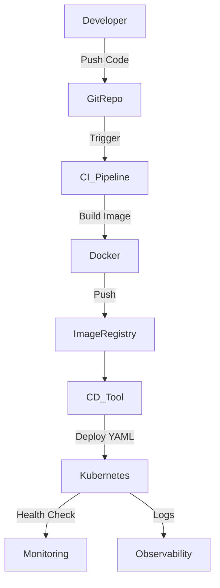

## **CI/CD Integration in Kubernetes**

---

### **Purpose**

CI/CD (Continuous Integration and Continuous Deployment/Delivery) integration in Kubernetes enables **automated building, testing, and deployment** of applications directly into clusters, ensuring **faster releases**, **higher reliability**, and **consistent environments**.

---

## **CI/CD Pipeline Phases in Kubernetes**

| Phase      | Description                                          |
| ---------- | ---------------------------------------------------- |
| **Build**  | Compile code, run unit tests, build container images |
| **Test**   | Integration tests, static analysis, security scans   |
| **Push**   | Push built images to container registry              |
| **Deploy** | Apply YAML, Helm, or GitOps to update workloads      |
| **Verify** | Smoke tests, health checks, rollback on failure      |

---

## **Popular CI/CD Tools for Kubernetes**

| Tool               | Description                                                |
| ------------------ | ---------------------------------------------------------- |
| **Jenkins**        | Traditional CI/CD server; with plugins for K8s integration |
| **GitLab CI**      | Integrated Git repo + CI/CD + Kubernetes support           |
| **Argo CD**        | Kubernetes-native GitOps continuous delivery               |
| **Argo Workflows** | Kubernetes-native workflows engine                         |
| **Tekton**         | K8s-native CI/CD pipelines via CRDs                        |
| **Flux**           | GitOps-based CD with automatic sync from Git               |
| **CircleCI**       | Cloud CI/CD with Kubernetes and Docker support             |
| **GitHub Actions** | Git-based CI/CD with K8s deployment workflows              |

---

## **Kubernetes-Native CI/CD Architecture Diagram (Mermaid)**



---

## **Deployment Methods in CI/CD**

### **Kubectl Apply**

* Use CLI to apply YAML to cluster.

```bash
kubectl apply -f deployment.yaml
```

### **Helm**

* Helm charts for templated, versioned deployments.

```bash
helm upgrade --install myapp ./chart
```

### **Kustomize**

* Customize overlays per environment (dev/stage/prod).

### **GitOps (Argo CD / Flux)**

* Sync deployment state from Git repo automatically.
* Declarative, audit-friendly.

---

## **Tekton Pipelines (Example)**

* Fully Kubernetes-native CI/CD framework.
* Define Tasks and Pipelines as CRDs.

```yaml
apiVersion: tekton.dev/v1beta1
kind: Task
metadata:
  name: build-image
spec:
  steps:
    - name: build
      image: gcr.io/kaniko-project/executor
      args: ["--dockerfile=Dockerfile", "--context=dir://workspace"]
```

---

## **Argo CD (GitOps CD)**

* Continuously monitors Git repo for changes.
* Automatically syncs desired state to the cluster.
* Visual dashboard and RBAC support.

---

## **Best Practices**

* Use **namespaces** to isolate CI/CD environments.
* Run CI/CD pipelines as **Kubernetes jobs or pods**.
* Use **RBAC policies** to restrict pipeline permissions.
* Store secrets in **Kubernetes Secrets** or **Vault**.
* Automate **rollback** on failed deploys.
* Monitor pipeline performance and failure trends.

---
