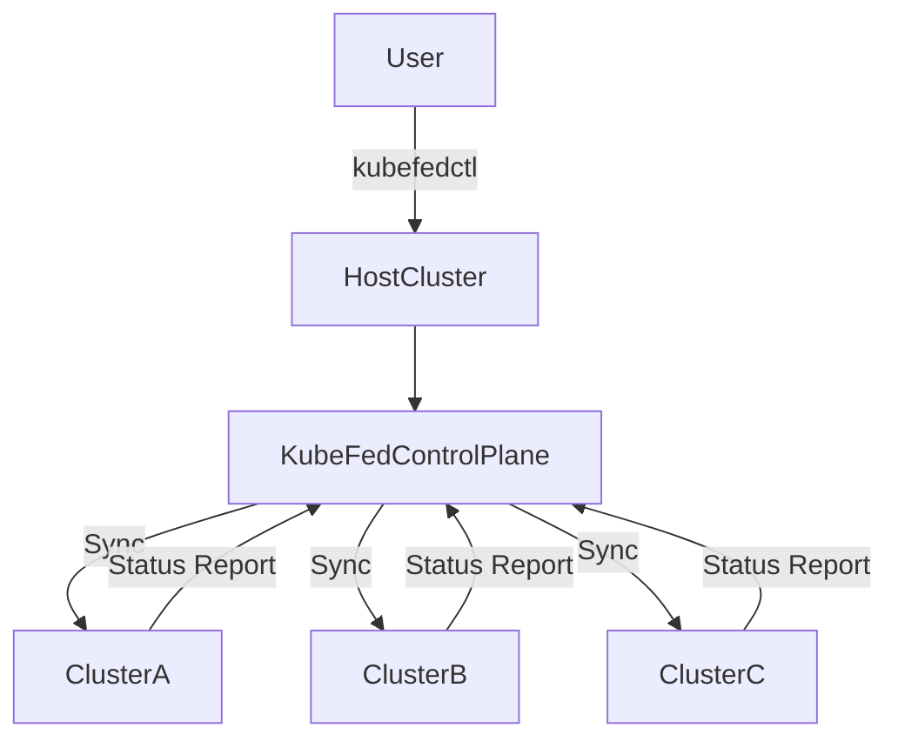

## **Multi-Cluster and Federation in Kubernetes**

---

### **Purpose**

Multi-cluster and federation strategies allow Kubernetes workloads to span across **multiple independent clusters** to improve:

* **High availability**
* **Disaster recovery**
* **Geographic distribution**
* **Compliance and isolation**
* **Scaling beyond single cluster limits**

---

## **Multi-Cluster Architecture**

---

### **Definition**

Running and managing **two or more Kubernetes clusters** that may or may not communicate with each other.

---

### **Types of Multi-Cluster Topologies**

| Topology           | Description                                                           |
| ------------------ | --------------------------------------------------------------------- |
| **Isolated**       | Clusters run independently with no direct communication               |
| **Shared Control** | One cluster (hub) controls or observes others (spokes)                |
| **Connected**      | Clusters can directly access each other's APIs or services            |
| **Hierarchical**   | Central cluster manages configurations/policies across child clusters |

---

### **Challenges in Multi-Cluster**

* Consistent configuration across clusters
* Multi-cluster service discovery
* Authentication and authorization
* Centralized monitoring/logging
* Traffic routing and load balancing

---

## **Federation in Kubernetes**

---

### **Definition**

**Kubernetes Federation** allows you to manage multiple clusters as a **single logical cluster**, enabling global deployment and synchronization of resources.

---

### **Key Features**

* Sync **resources** (e.g., Deployments, Services) across clusters
* Control policies from a **single API**
* Multi-region failover
* Cross-cluster service discovery

---

### **KubeFed (v2)**

Official tool for Kubernetes Federation.

```bash
kubefedctl join <cluster> --host-cluster-context=<host>
```

---

### **KubeFed Architecture Diagram (Mermaid)**



---

### **Components of KubeFed**

| Component          | Description                                          |
| ------------------ | ---------------------------------------------------- |
| **kubefedctl**     | CLI to control federation setup                      |
| **KubeFed API**    | Extends Kubernetes API with federated resource types |
| **Controllers**    | Synchronize resources and track health/status        |
| **FederatedTypes** | Custom Resource Definitions for synced resources     |

---

## **Alternatives to Federation**

| Tool/Pattern                               | Description                                    |
| ------------------------------------------ | ---------------------------------------------- |
| **GitOps** (e.g., Argo CD, Flux)           | Push configs to multiple clusters via Git      |
| **Service Mesh** (e.g., Istio, Linkerd)    | Secure, multi-cluster traffic routing          |
| **Cluster API**                            | Declarative cluster lifecycle management       |
| **Central Control Plane**                  | Tools like Rancher to manage multiple clusters |
| **Multi-Cloud Gateway** (e.g., Submariner) | Cross-cluster networking & discovery           |

---

## **Multi-Cluster Service Discovery**

### Approaches

* **DNS-based routing** using external load balancers
* **Service Mesh (Istio Multi-Cluster)** with:

  * Shared control plane or
  * Replicated control planes
* **Submariner**: Direct cross-cluster pod-to-pod communication

---

### Use Cases

* High-availability across regions
* Disaster recovery clusters
* Geo-localized deployments (data residency laws)
* Production-staging separation

---

## **Best Practices**

* Define clear **cluster boundaries and roles**
* Use **GitOps** for configuration sync
* Enforce **RBAC** and network policies across clusters
* Enable **observability tools** (e.g., Prometheus/Grafana with Thanos)
* Plan for **cluster lifecycle management** and upgrades

---
