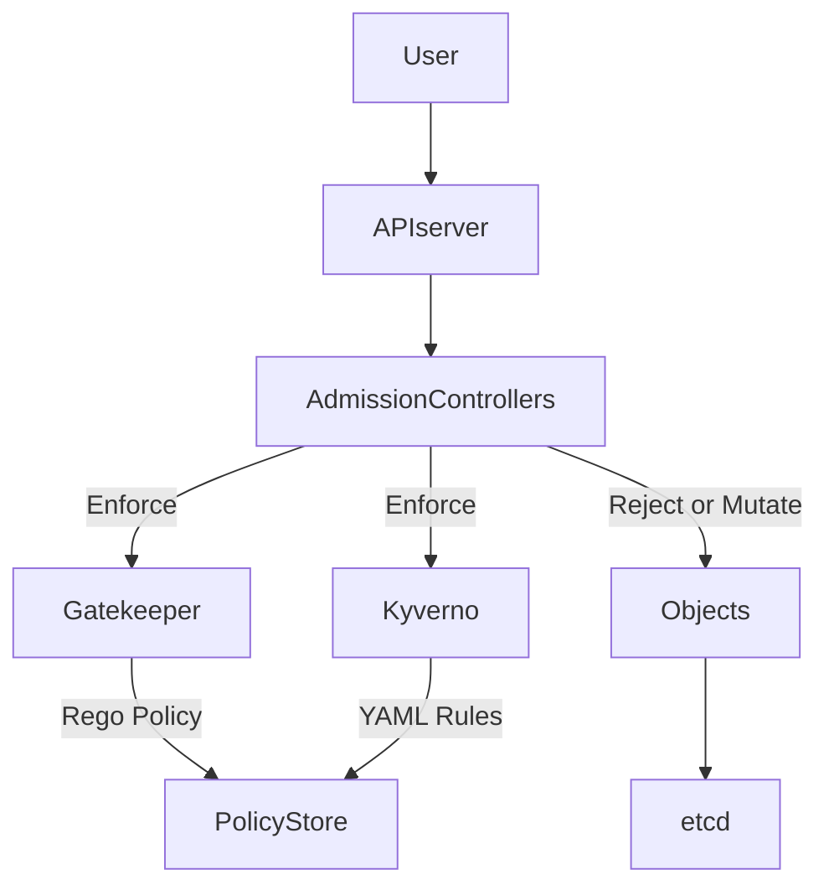

## **Policy and Governance in Kubernetes**

---

### **Purpose**

Policy and governance in Kubernetes help enforce **security**, **compliance**, and **operational consistency** across the cluster by setting **rules and restrictions** for workloads, users, and resources.

---

## **Core Areas of Governance**

| Area                           | Description                                                      |
| ------------------------------ | ---------------------------------------------------------------- |
| **Access Control**             | Who can do what within the cluster                               |
| **Resource Quotas**            | Limit CPU, memory, storage usage per namespace or team           |
| **Security Policies**          | Restrict what pods can do (e.g., run as root, access host files) |
| **Network Policies**           | Define allowed communication paths between pods                  |
| **Image Policies**             | Control which container images are allowed                       |
| **Audit Logging**              | Track all cluster activity for compliance and analysis           |
| **Cost & Resource Governance** | Ensure fair and efficient use of compute resources               |

---

## **Key Kubernetes Governance Tools**

| Tool/Feature                         | Function                                                              |
| ------------------------------------ | --------------------------------------------------------------------- |
| **RBAC (Role-Based Access Control)** | Grant permissions at API group/verb/resource level                    |
| **NetworkPolicy**                    | Limit pod-to-pod or pod-to-external traffic                           |
| **PodSecurityPolicy** (deprecated)   | Define pod-level security rules (replaced by PodSecurity)             |
| **PodSecurity Admission**            | Enforce security profiles like `restricted`, `baseline`, `privileged` |
| **OPA/Gatekeeper**                   | Policy as code using Rego (e.g., block certain labels or images)      |
| **Kyverno**                          | Kubernetes-native policy engine using simple YAML                     |
| **ResourceQuota**                    | Limit resource usage per namespace                                    |
| **LimitRange**                       | Set min/max/default for CPU/mem per container                         |
| **Audit Policy**                     | Control what is logged and at what level                              |

---

## **Architecture Diagram of Policy Enforcement (Mermaid)**



---

## **RBAC (Role-Based Access Control)**

* Define **Roles** and **RoleBindings**:

```yaml
apiVersion: rbac.authorization.k8s.io/v1
kind: Role
metadata:
  name: pod-reader
rules:
- apiGroups: [""]
  resources: ["pods"]
  verbs: ["get", "list"]
```

---

## **OPA Gatekeeper (Policy as Code)**

* Define constraints and templates using Rego language
* Example: deny `latest` tag usage

```rego
violation[{"msg": msg}] {
  input.review.object.spec.containers[_].image == "latest"
  msg := "Using 'latest' tag is not allowed"
}
```

---

## **Kyverno (YAML-based Policy Engine)**

* Easier to write and maintain than Rego

```yaml
apiVersion: kyverno.io/v1
kind: ClusterPolicy
metadata:
  name: disallow-latest-tag
spec:
  validationFailureAction: enforce
  rules:
    - name: check-tag
      match:
        resources:
          kinds: ["Pod"]
      validate:
        message: "Do not use 'latest' tag."
        pattern:
          spec:
            containers:
              - image: "!*:latest"
```

---

## **Resource and Cost Governance**

| Feature                    | Use Case                            |
| -------------------------- | ----------------------------------- |
| **ResourceQuota**          | Limit total resources per namespace |
| **LimitRange**             | Set per-container constraints       |
| **Namespace-based limits** | Assign quotas per team/application  |
| **Labels/Annotations**     | Track ownership and billing info    |

---

## **Security Governance**

| Tool/Setting               | Role                                            |
| -------------------------- | ----------------------------------------------- |
| **PodSecurity Admission**  | Enforce pod security standards                  |
| **Seccomp/AppArmor**       | Restrict syscall access                         |
| **Runtime Security Tools** | (e.g., Falco, Sysdig) monitor runtime behaviors |

---

## **Audit Logging**

* Enabled via `audit-policy.yaml`
* Stores **who, what, when, where** actions
* Can integrate with ELK, Fluentd, SIEM

---

## **Best Practices**

* Enforce **least privilege** via RBAC
* Use **OPA/Gatekeeper or Kyverno** for custom policies
* Restrict pod capabilities using **PodSecurity profiles**
* Implement **NetworkPolicies** by default
* Regularly **review and audit logs** and roles
* Separate environments using **namespaces + quotas**
* Document and version control all policies

---
