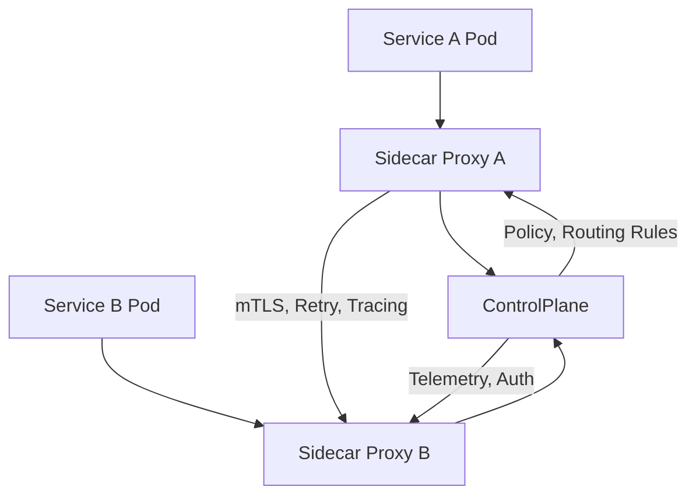

## **Service Mesh Integration in Kubernetes**

---

### **Purpose**

Service Mesh integration provides **fine-grained control over service-to-service communication** in Kubernetes by **abstracting complex networking features** such as traffic routing, observability, security, and resilience.

---

## **Core Functions of a Service Mesh**

| Function               | Description                                  |
| ---------------------- | -------------------------------------------- |
| **Traffic Management** | Fine control over routing, retries, timeouts |
| **Security**           | mTLS encryption, identity, access policies   |
| **Observability**      | Metrics, logs, and distributed tracing       |
| **Resilience**         | Retries, failovers, circuit breakers         |
| **Policy Enforcement** | Access control, rate limiting, quotas        |

---

## **Popular Service Mesh Options**

| Tool                        | Key Features                                              |
| --------------------------- | --------------------------------------------------------- |
| **Istio**                   | Most feature-rich; supports mTLS, RBAC, traffic splitting |
| **Linkerd**                 | Lightweight, simpler to deploy, great default performance |
| **Consul**                  | Mesh + Service discovery and KV store                     |
| **Kuma**                    | Built by Kong; supports multi-mesh deployments            |
| **Open Service Mesh (OSM)** | Microsoft’s SMI-compliant lightweight mesh                |

---

## **High-Level Architecture of a Service Mesh**



---

### **Components**

| Component         | Role                                                           |
| ----------------- | -------------------------------------------------------------- |
| **Data Plane**    | Sidecar proxies (e.g., Envoy) intercept traffic in/out of pods |
| **Control Plane** | Configures proxies, enforces policies (e.g., Istiod, Linkerd2) |
| **Sidecar Proxy** | Handles encryption, routing, retries, metrics, etc.            |

---

## **Istio Integration Example**

* Automatically injects **Envoy sidecar** in pods via mutating webhook
* Uses **Istiod** as control plane
* Defines config using `VirtualService`, `DestinationRule`, etc.

```yaml
apiVersion: networking.istio.io/v1beta1
kind: VirtualService
metadata:
  name: frontend
spec:
  hosts:
    - frontend
  http:
    - route:
        - destination:
            host: frontend
            subset: v1
```

---

## **Service Mesh Interface (SMI)**

* A standard interface for service meshes on Kubernetes
* Abstracts vendor-specific APIs for easier adoption

---

## **Use Cases**

* **A/B Testing** and **Canary Deployments**
* Enforce **Zero Trust Security** with mTLS
* In-depth **tracing and monitoring** (Jaeger, Prometheus)
* Enforce **SLOs** with retries/timeouts/circuit breakers
* **Multi-cluster communication** via mesh gateways

---

## **Challenges**

* Increased complexity in configuration and debugging
* Additional resource usage (memory/CPU from proxies)
* Steep learning curve for advanced features
* Requires observability to be useful (integrate Grafana, Prometheus, Jaeger)

---

## **Best Practices**

* Start with **Linkerd** or **OSM** if new to meshes
* Monitor performance overhead of sidecars
* Use **automated injection** for sidecar consistency
* Manage configs declaratively (YAML, GitOps)
* Integrate with **CI/CD** for progressive delivery
* Scope mesh to only **critical namespaces/services**

---
