## Mermaid

## **Basics**  

#### **What is Mermaid?**  
Mermaid is a JavaScript-based diagramming tool that allows creating various types of charts using text-based syntax.  

#### **Syntax Overview**  
- Every diagram starts with `%%{init}` (optional) for configuration.  
- The first line specifies the diagram type.  
- Nodes and relationships are defined with simple text-based syntax.  

**Example:**  
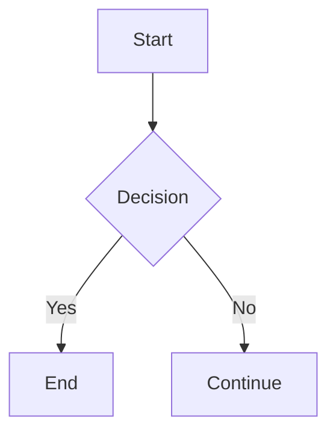

#### **Diagram Types**
Here is the updated table with all supported Mermaid.js diagram types, including descriptions, purposes, version introduced, and platform support.

| Diagram Type                 | Description | Purpose | Version Introduced | Platform Support |
|------------------------------|-------------|---------|--------------------|-----------------|
| **Flowchart**                 | Visual representation of processes or workflows using nodes and edges. | Process modeling, workflow representation. | v0.1 | ✅ All platforms |
| **Sequence Diagram**          | Depicts interactions between entities over time, showing the sequence of messages exchanged. | System interaction modeling, API flow visualization. | v0.2 | ✅ All platforms |
| **Gantt Chart**               | Illustrates project schedules, showing tasks, durations, and dependencies. | Project management, scheduling. | v0.3 | ✅ All platforms |
| **Class Diagram**             | Represents the structure of classes in a system, including their attributes and relationships. | Object-oriented modeling, software architecture. | v8.0 | ✅ All platforms |
| **State Diagram**             | Shows the different states of an entity and the transitions between those states. | Finite-state machine modeling, UI design. | v8.0 | ✅ All platforms |
| **Entity Relationship Diagram (ERD)** | Illustrates entities within a system and their relationships. | Database design, schema visualization. | v9.0 | ✅ All platforms |
| **User Journey Diagram**      | Maps out the steps a user takes to achieve a specific goal within a system. | UX research, customer journey mapping. | v9.0 | ✅ All platforms |
| **Pie Chart**                 | Displays data in a circular graph divided into slices to illustrate numerical proportions. | Data visualization, statistics. | v9.1 | ✅ All platforms |
| **Git Graph**                 | Visualizes Git repository structures, including commits, branches, and merges. | Version control history representation. | v9.2 | ✅ All platforms |
| **Requirement Diagram**       | Represents requirements and their relationships in a system. | Requirement management, system design. | v10.0 | ✅ All platforms |
| **Mind Map**                  | Visualizes hierarchical information, showing relationships between concepts. | Idea organization, brainstorming. | v10.2 | ✅ All platforms |
| **Timeline**                  | Displays events in chronological order along a linear timeline. | Event tracking, historical data representation. | v10.4 | ✅ All platforms |
| **Quadrant Chart**            | Divides data points into four quadrants based on two axes to analyze their distribution. | Market analysis, risk assessment. | v10.5 | ✅ All platforms |
| **XY Chart**                  | Represents data points on a two-dimensional plane, useful for scatter plots and line graphs. | Data analysis, trend visualization. | v10.5 | ✅ All platforms |
| **Sankey Diagram**            | Visualizes flow quantities between different nodes, emphasizing the magnitude of transfers. | Energy flow, resource distribution analysis. | v10.6 | ✅ All platforms |
| **Gantt Diagram**             | Depicts project timelines, tasks, and their dependencies. | Project tracking, scheduling. | v10.7 | ✅ All platforms |
| **Kanban**                    | Represents tasks in columns, typically used for workflow visualization. | Agile project management, task tracking. | v10.8 | ✅ All platforms |
| **Architecture Diagram**       | Illustrates the structural design of systems or software architectures. | System architecture documentation. | v10.9 | ✅ All platforms |
| **Block Diagram**             | Shows system components and their interconnections in a simplified manner. | Hardware design, system architecture. | v11.0 | ✅ All platforms |
| **Packet Diagram**            | Visualizes data packet structures and flows in networking contexts. | Network analysis, protocol visualization. | v11.1 | ✅ All platforms |

#### **Supporting Platforms**

| **Platform**           | **Support** | **Notes** |
|------------------------|------------|-----------|
| **GitHub**            | ✅ Yes | Native support in markdown files (`.md`) |
| **GitLab**            | ✅ Yes | Supported in GitLab wiki, issues, and merge requests |
| **Azure DevOps**      | ✅ Yes | Supported in wiki pages |
| **Obsidian**          | ✅ Yes | Requires built-in or third-party Mermaid plugin |
| **Jupyter Notebook**  | ✅ Yes | Needs `mermaid` integration via Jupyter extensions |
| **Markdown Editors**  | ✅ Yes | Supported in some editors like Typora, Mark Text (with plugins) |
| **VS Code**           | ✅ Yes | Supported via extensions like "Markdown Preview Mermaid Support" |
| **Docusaurus**        | ✅ Yes | Native support for Mermaid diagrams |
| **Hugo (Static Site Generator)** | ✅ Yes | Requires Mermaid.js integration in themes |
| **Hexo (Static Site Generator)** | ✅ Yes | Supported with third-party plugins |
| **Notion**            | ❌ No | Not natively supported, but can embed images of diagrams |
| **Google Docs**       | ❌ No | Requires third-party add-ons |
| **Microsoft Word**    | ❌ No | Not directly supported, but can use embedded images |

---

## Diagrams

### **Flowcharts**  

#### **Nodes and Links**  
- Nodes represent elements in the flowchart.  
- Links connect nodes using arrows (`-->`, `--x`, `-.->`).  

**Example:**  
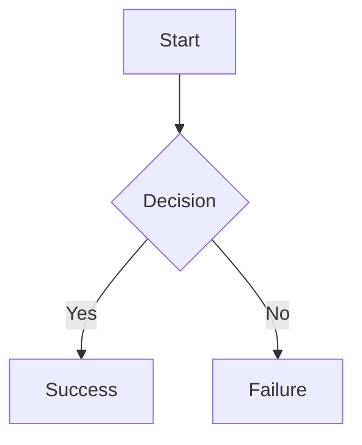

#### **Direction & Layout**  
- `TD` → Top to Bottom  
- `LR` → Left to Right  
- `BT` → Bottom to Top  
- `RL` → Right to Left  

**Example:**  
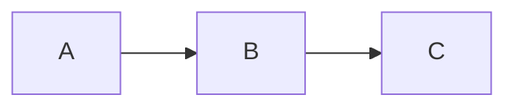

#### **Styling Nodes and Edges**  
- Nodes can have styles (`fill`, `stroke`, `font-size`).  
- Edges can have text and styles.  

**Example:**  
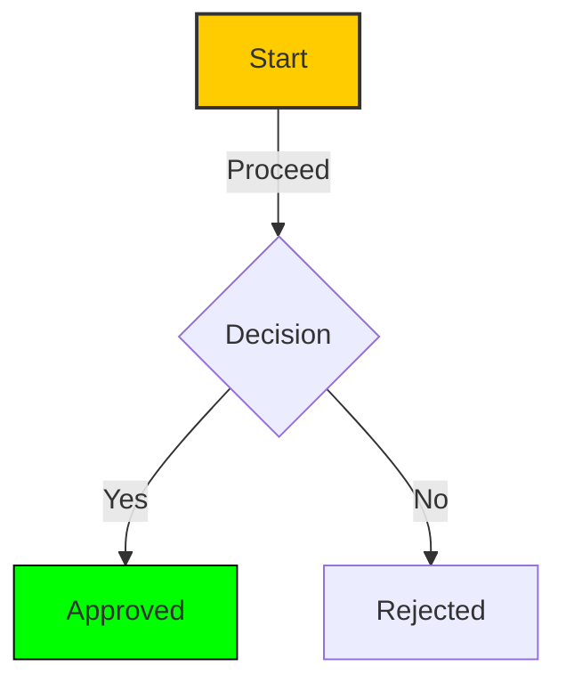

#### **Subgraphs**  
- Group nodes into clusters using `subgraph`.  

**Example:**  
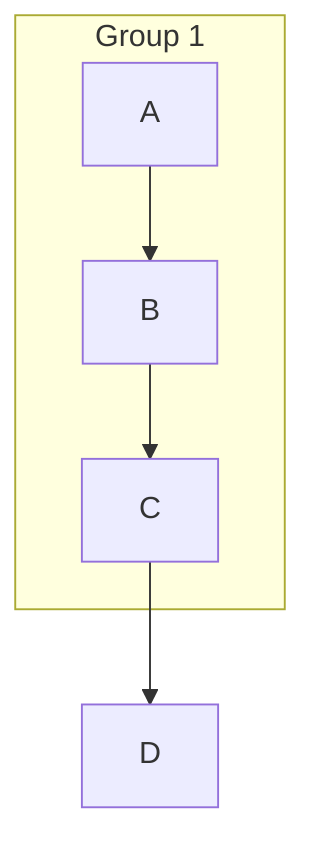

---

### **Sequence Diagrams**  

#### **Participants**  
- Define entities in a sequence diagram using `participant`.  

**Example:**  
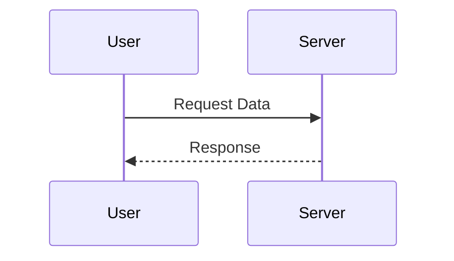

#### **Messages**  
- `->>` → Solid arrow (synchronous)  
- `-->>` → Dashed arrow (asynchronous)  
- `->>` with `+` → Activation  

**Example:**  
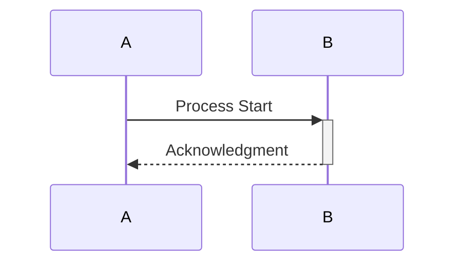

#### **Activation & Deactivation**  
- `+` → Activate a participant  
- `-` → Deactivate a participant  

**Example:**  
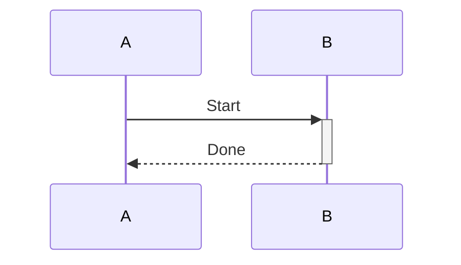

#### **Loops, Alternatives, and Conditions**  
- `loop` → Repeats actions  
- `alt` → Alternatives (if-else)  
- `opt` → Optional block  

**Example:**  
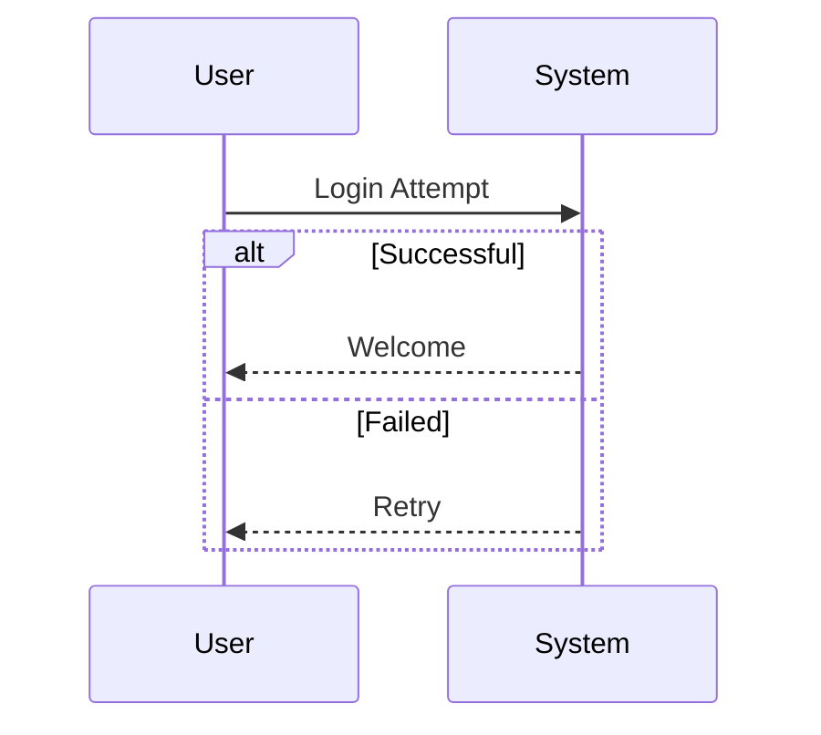

---

### **Gantt Charts**  

#### **Tasks and Dependencies**  
- Gantt charts define project tasks with dependencies and timelines.  
- Format:  
  - `title` → Sets the chart title.  
  - `dateFormat` → Defines the date format.  
  - `section` → Groups tasks.  

**Example:**  
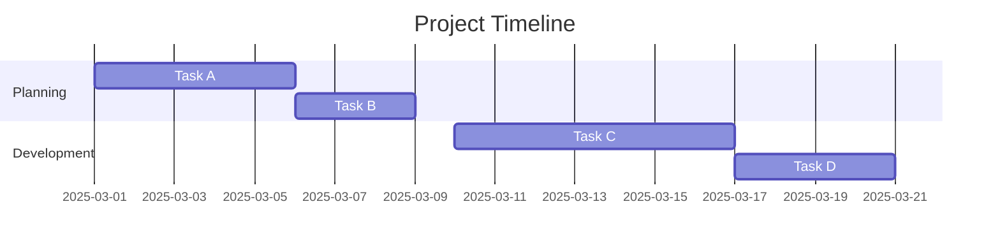

#### **Styling and Customization**  
- `color` → Change task colors.  
- `done` → Mark task completion.  

**Example:**  
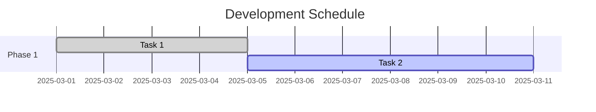

---

### **Pie Charts**  

#### **Defining Pie Charts**  
- Format:  
  - `pie` → Defines a pie chart.  
  - Data values are written as `label: value`.  

**Example:**  
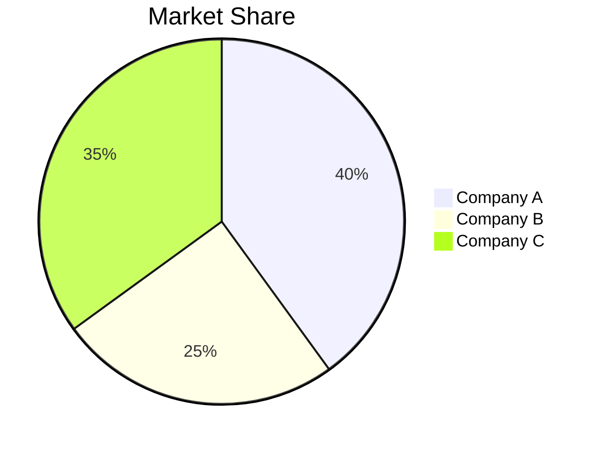

#### **Customization**  
- Titles can be added using `title`.  
- Values should be numerical, representing proportions.  

---

### **Class Diagrams**  

#### **Defining Classes and Relationships**  
- Classes are defined using `classDiagram`.  
- Syntax:  
  - `ClassName` → Defines a class.  
  - `+` (public), `-` (private), `#` (protected).  
  - `ClassA --|> ClassB` → Inheritance.  
  - `ClassA -- ClassB` → Association.  
  - `ClassA o-- ClassB` → Composition.  
  - `ClassA *-- ClassB` → Aggregation.  

**Example:**  
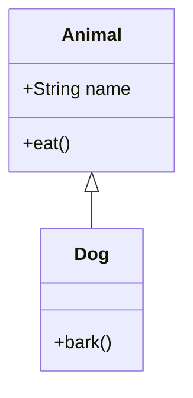

#### **Inheritance and Composition**  
- `--|>` → Inheritance  
- `*--` → Composition  
- `o--` → Aggregation  

**Example:**  
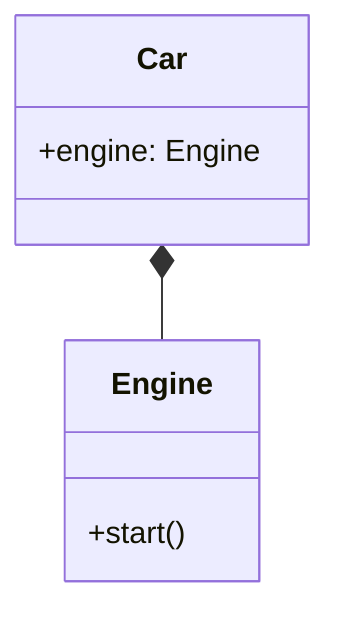


---

### **Entity Relationship Diagrams (ERD)**  

#### **Entities and Relationships**  
- `erDiagram` → Defines an ER diagram.  
- Entities are written as `ENTITY_NAME {}`.  
- Relationships:  
  - `||--||` → One-to-One  
  - `||--o{` → One-to-Many  
  - `}o--o{` → Many-to-Many  

**Example:**  
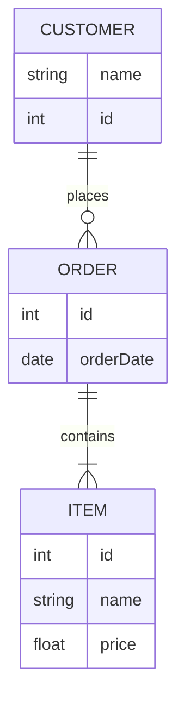

---

### **State Diagrams**  

#### **States and Transitions**  
- `stateDiagram` → Defines a state diagram.  
- States are written as `StateName`.  
- Transitions use `-->`.  

**Example:**  
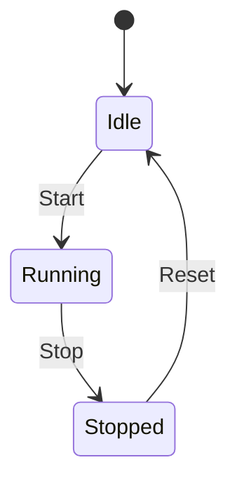

#### **Styling and Customization**  
- Use `[ ]` for the start and end states.  
- Arrows represent transitions.  
- Labels describe transitions.  

**Example:**  
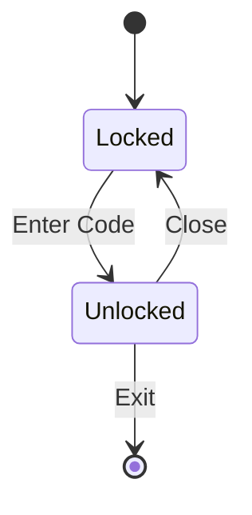

---

### **User Journey Diagrams**  

#### **Defining Steps**  
- `journey` → Defines a user journey diagram.  
- `section` → Groups steps.  
- Format:  
  - `User: Task, State`  

**Example:**  
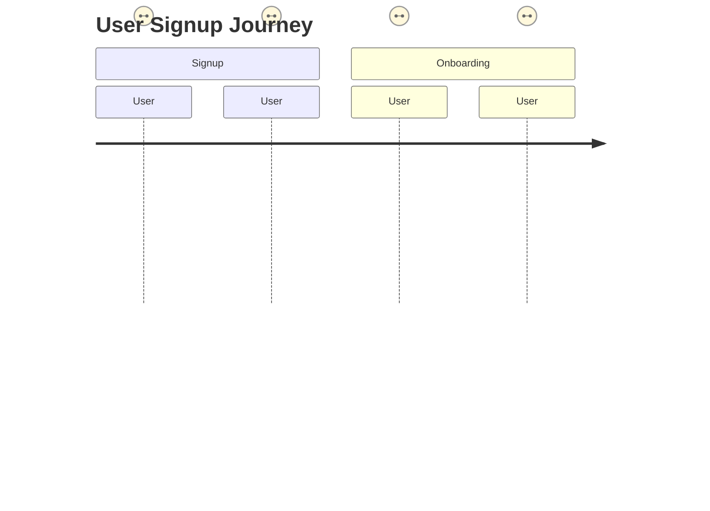

#### **Customization**  
- Numbers represent user experience ratings (1-5).  
- Sections categorize different phases.  

---

### **Mind Maps**  

#### **Structure and Formatting**  
- `mindmap` → Defines a mind map.  
- Indentation represents hierarchy.  
- Nodes are written as `Root --> Child`.  

**Example:**  
```mermaid
mindmap  
    root((Main Topic))  
        subtopic1(Subtopic 1)  
            subsub1(Detail 1)  
            subsub2(Detail 2)  
        subtopic2(Subtopic 2)  
```

#### **Styling and Customization**  
- Use `(( ))` for rounded nodes.  
- Nodes can have multiple branches.  

**Example:**  
```mermaid
mindmap  
    root((Learning Path))  
        Frontend  
            HTML  
            CSS  
            JavaScript  
        Backend  
            Node.js  
            Python  
```

---

### **Git Graphs**

**Git graphs** in Mermaid.js provide a visual representation of Git repositories, illustrating commits, branches, merges, and more. This is particularly useful for documenting workflows and understanding project histories.

#### **Defining a Git Graph**

- **Initialization**: Begin with the `gitGraph` keyword to specify the diagram type.

- **Commits**: Use the `commit` keyword to represent individual commits.

**Example:**

```mermaid
gitGraph
    commit id: "Initial Commit"
    commit id: "Second Commit"
    commit id: "Third Commit"
```


This will render a linear sequence of commits on the default `main` branch.

#### **Branches**

- **Creating a Branch**: Use the `branch` keyword followed by the branch name. This also checks out the new branch.

- **Switching Branches**: Use the `checkout` keyword followed by the branch name to switch between branches.

**Example:**

```mermaid
gitGraph
    commit id: "Initial Commit"
    branch develop
    commit id: "Develop Commit"
    checkout main
    commit id: "Main Commit"
```


In this example, a `develop` branch is created and a commit is made on it. Then, we switch back to the `main` branch and make another commit.

#### **Merging Branches**

- **Merging**: Use the `merge` keyword followed by the branch name to merge the specified branch into the current branch.

**Example:**

```mermaid
gitGraph
    commit id: "Initial Commit"
    branch feature
    commit id: "Feature Commit"
    checkout main
    merge feature
```


Here, the `feature` branch is merged into the `main` branch.

#### **Cherry-Picking Commits**

- **Cherry-Picking**: Use the `cherry-pick` keyword followed by the commit ID to apply a specific commit from another branch onto the current branch.

**Example:**

```mermaid
gitGraph
    commit id: "Initial Commit"
    branch feature
    commit id: "Feature Commit"
    checkout main
    cherry-pick id: "Feature Commit"
```


This applies the `Feature Commit` from the `feature` branch onto the `main` branch without merging the entire branch.

#### **Customizing Commits**

- **Commit Types**: Specify commit types to differentiate them visually:

  - `NORMAL`: Default commit type, represented by a solid circle.

  - `REVERSE`: Indicates a reverse commit, shown as a crossed circle.

  - `HIGHLIGHT`: Highlights a particular commit, displayed as a filled rectangle.

**Example:**

```mermaid
gitGraph
    commit id: "Normal Commit"
    commit id: "Reverse Commit" type: REVERSE
    commit id: "Highlight Commit" type: HIGHLIGHT
```


This will render commits with different visual representations based on their types.

For more detailed information and advanced configurations, refer to the [Mermaid.js GitGraph documentation](https://mermaid.js.org/syntax/gitgraph.html). 

---

#### **Customization Options**  
- **Multiple Sections** → Organizes events.  
- **Date Formats** → Uses YYYY-MM-DD format.  
- **Sorting** → Events appear in chronological order.  

This timeline represents the different phases of a project, marking key milestones.

---

### **Requirement Diagram**

#### **Overview**
- **Purpose**: Represents system requirements and their relationships.  
- **Use Cases**: System design, requirement tracking, verification, and validation.  

---

#### **Defining Requirements**
- `requirement <name> {}` → Defines a requirement block.  
- Attributes:  
  - **`id`** → Unique identifier.  
  - **`text`** → Description of the requirement.  
  - **`risk`** → Risk level (`Low`, `Medium`, `High`).  
  - **`verifymethod`** → How it is verified (`Analysis`, `Inspection`, `Test`, `Demonstration`).  

**Example:**
```mermaid
requirementDiagram
  requirement user_auth {
      id: R1
      text: "User must be authenticated"
      risk: High
      verifymethod: Test
  }
```

---

#### **Defining Elements**
- `element <name> {}` → Represents system components that fulfill requirements.  
- Attributes:  
  - **`type`** → Type of element (e.g., `SoftwareComponent`, `HardwareComponent`).  
  - **`docref`** → Associated documentation.  

**Example:**
```mermaid
requirementDiagram
  element login_system {
      type: SoftwareComponent
      docref: "auth_design_spec.pdf"
  }
```

---

#### **Relationships**
| Relationship   | Description |
|---------------|------------|
| `-satisfies->` | Component satisfies a requirement |
| `-verifies->`  | Ensures requirement is met |
| `-contains->`  | Groups related requirements |
| `-traces->`    | Tracks a requirement across development |
| `-refines->`   | A requirement refines another |
| `-derives->`   | A requirement derives from another |

**Example:**
```mermaid
requirementDiagram
  login_system -satisfies-> user_auth
```

---

#### **Complete Example**
```mermaid
requirementDiagram
  requirement user_auth {
      id: R1
      text: "User must be authenticated"
      risk: High
      verifymethod: Test
  }
  element login_system {
      type: SoftwareComponent
      docref: "auth_design_spec.pdf"
  }
  login_system -satisfies-> user_auth
```

This example defines an authentication requirement (`user_auth`), a system component (`login_system`), and shows that `login_system` satisfies `user_auth`.

---

### **Timeline Diagram**  

#### **Overview**  
- **Purpose**: Represents events in a chronological sequence.  
- **Use Cases**: Project management, historical timelines, event tracking.  

---

#### **Defining a Timeline**  
- `timeline` → Starts the diagram.  
- `title` → Adds a title to the timeline.  
- `section <name>` → Groups events under a section.  
- `date: description` → Specifies an event with a date and description.  

**Example:**  
```mermaid
timeline
    title Project Development Timeline
    section Planning
      2024-01-01: Project Kickoff
      2024-02-15: Requirement Analysis Completed
    section Development
      2024-03-01: Prototype Created
      2024-06-30: Beta Release
    section Deployment
      2024-09-01: Public Release
```

---

#### **Customization Options**  
- **Multiple Sections** → Organizes events.  
- **Date Formats** → Uses YYYY-MM-DD format.  
- **Sorting** → Events appear in chronological order.  

This timeline represents the different phases of a project, marking key milestones.

---


### **Quadrant Chart**  

#### **Overview**  
- **Purpose**: Displays data points in four quadrants based on two variables.  
- **Use Cases**: SWOT analysis, risk assessment, performance evaluation.  

---

#### **Defining a Quadrant Chart**  
- `quadrantChart` → Starts the diagram.  
- `title` → Adds a title to the chart.  
- `x-axis "Label1" → "Label2"` → Defines the horizontal axis labels.  
- `y-axis "Label1" → "Label2"` → Defines the vertical axis labels.  
- `("Label", x, y)` → Plots a data point at (x, y).  

**Example:**  
```mermaid
quadrantChart
    title Risk vs Impact Analysis
    x-axis Low → High
    y-axis Low → High
    ("Low Risk, Low Impact", 1, 1)
    ("High Risk, Low Impact", 3, 1)
    ("Low Risk, High Impact", 1, 3)
    ("High Risk, High Impact", 3, 3)
```

---

#### **Customization Options**  
- **Adjusting Axes** → Change labels to fit the analysis.  
- **Multiple Points** → Add various data points.  
- **Scaling** → X and Y values determine placement within the quadrants.  

This chart categorizes data into four quadrants based on defined criteria.

---


### **XY Chart**  

#### **Overview**  
- **Purpose**: Plots points on a 2D coordinate system using X and Y values.  
- **Use Cases**: Data visualization, performance analysis, correlation studies.  

---

#### **Defining an XY Chart**  
Mermaid.js **does not support** a direct XY chart, but you can use a **Quadrant Chart** as an alternative.  

- `quadrantChart` → Plots points on an XY plane.  
- `x-axis "Label1" → "Label2"` → Defines horizontal axis labels.  
- `y-axis "Label1" → "Label2"` → Defines vertical axis labels.  
- `("Label", x, y)` → Plots a data point at (x, y).  

**Example:**  
```mermaid
quadrantChart
    title Sales Performance Analysis
    x-axis Low Revenue → High Revenue
    y-axis Low Growth → High Growth
    ("Product A", 2, 3)
    ("Product B", 4, 5)
    ("Product C", 1, 2)
    ("Product D", 3, 4)
```

---

#### **Customization Options**  
- **Change Axes Labels** → Modify `x-axis` and `y-axis` to fit your analysis.  
- **Multiple Data Points** → Add as many points as needed.  
- **Scaling** → Adjust X and Y values for accurate positioning.  

Since Mermaid.js does not natively support an **XY scatter plot**, consider using tools like **Matplotlib (Python) or Chart.js (JavaScript)** for detailed data plotting.

---

### **Sankey Diagram**  

#### **Overview**  
- **Purpose**: Represents flow of quantities between different entities.  
- **Use Cases**: Visualizing resource distribution, energy flow, budget allocation.  

---

#### **Defining a Sankey Diagram**  
- `sankey-diagram` → Starts the diagram.  
- `Node1[Value] --> Node2[Value]` → Defines flow between nodes.  

**Example:**  
```mermaid
sankey-diagram
    title Energy Distribution
    Source[100] --> Production[80]
    Source[100] --> Losses[20]
    Production[80] --> Industry[50]
    Production[80] --> Residential[30]
```

---

#### **Customization Options**  
- **Adjusting Flow Values** → Modify numeric values for accurate representation.  
- **Multiple Flows** → Add multiple paths between nodes.  
- **Titles** → Use `title` to label the diagram.  

This example represents energy flow from a **source** to **production, industry, and residential sectors** while accounting for losses.

---

### **Gantt Diagram**  

#### **Overview**  
- **Purpose**: Visualizes project tasks, timelines, and dependencies.  
- **Use Cases**: Project planning, scheduling, resource allocation.  

---

#### **Defining a Gantt Chart**  
- `gantt` → Starts the diagram.  
- `title` → Adds a title to the chart.  
- `dateFormat YYYY-MM-DD` → Defines the date format.  
- `section <name>` → Groups tasks.  
- `Task Name: type, start_date, duration` → Defines a task.  

**Example:**  
```mermaid
gantt
    title Software Development Timeline
    dateFormat  YYYY-MM-DD
    section Planning
      Requirement Analysis: done, 2024-01-01, 10d
      Design Phase: active, 2024-01-12, 15d
    section Development
      Backend Development: 2024-02-01, 20d
      Frontend Development: 2024-02-15, 25d
    section Testing & Deployment
      Testing: 2024-03-10, 10d
      Deployment: 2024-03-20, 5d
```

---

#### **Customization Options**  
| **Option**     | **Description** |
|---------------|---------------|
| `done`        | Task is completed. |
| `active`      | Task is ongoing. |
| `crit`        | Marks a critical task. |
| `milestone`   | Represents a milestone (e.g., `Project Launch: milestone, 2024-04-01, 1d`). |

This Gantt chart helps track **project phases**, showing durations and dependencies.

---

### **Pie Chart**  

#### **Overview**  
- **Purpose**: Represents data distribution as a circular chart.  
- **Use Cases**: Percentage breakdowns, category comparisons, resource allocation.  

---

#### **Defining a Pie Chart**  
- `pie` → Starts the diagram.  
- `title` → Adds a title to the chart.  
- `<value>: <label>` → Defines a segment with its value and label.  

**Example:**  
```mermaid
pie
    title Budget Allocation
    40: Development
    25: Marketing
    20: Operations
    15: Research
```

---

#### **Customization Options**  
- **Adjusting Values** → Modify numbers to reflect proportions.  
- **Titles** → Use `title` to specify the chart’s purpose.  
- **Multiple Segments** → Add as many as needed.  

This pie chart shows a **budget allocation breakdown** into **development, marketing, operations, and research**.

---

### **Kanban Diagram**  

#### **Overview**  
- **Purpose**: Visualizes task progress across different stages in a workflow.  
- **Use Cases**: Task management, Agile development, project tracking.  

---

#### **Defining a Kanban Board**  
- `kanban` → Starts the diagram.  
- `title` → Adds a title to the board.  
- `column <name>` → Defines a workflow stage.  
- `card <Task>` → Adds a task under a column.  

**Example:**  
```mermaid
kanban
    title Project Workflow
    column Backlog
        card Gather Requirements
        card Research Technologies
    column In Progress
        card Develop UI
        card Backend API
    column Review
        card Code Review
    column Done
        card Deployment
```

---

#### **Customization Options**  
| **Option**    | **Description** |
|--------------|---------------|
| `title`      | Sets the board’s title. |
| `column`     | Defines workflow stages. |
| `card`       | Represents tasks inside a column. |

This **Kanban board** tracks tasks from **Backlog** to **Completion**, useful for Agile workflows.

---

### **Architecture Diagram**  

#### **Overview**  
- **Purpose**: Represents system components and their relationships.  
- **Use Cases**: Software architecture, cloud infrastructure, microservices.  

---

#### **Defining an Architecture Diagram**  
Mermaid.js **does not natively support** architecture diagrams. However, **flowcharts** and **graphs** can represent architecture visually.  

- `graph TD` → Defines a top-down architecture.  
- `graph LR` → Defines a left-to-right architecture.  
- `[Component]` → Represents a system component.  
- `-->` → Defines connections between components.  

**Example:**  
```mermaid
graph TD
    Client[User] -->|Requests| LoadBalancer
    LoadBalancer -->|Routes| WebServer1
    LoadBalancer -->|Routes| WebServer2
    WebServer1 -->|Processes| Database
    WebServer2 -->|Processes| Database
    Database -->|Stores| Storage
```

---

#### **Customization Options**  
| **Option**     | **Description** |
|---------------|---------------|
| `graph TD/LR` | Sets the diagram direction (Top-Down or Left-Right). |
| `-->`         | Defines relationships between components. |
| `-->|Label|`  | Adds labels to connections. |

This **architecture diagram** models a **web system with load balancing**, useful for **infrastructure planning**.

---

### **Block Diagram**  

#### **Overview**  
- **Purpose**: Represents system components as blocks and their interactions.  
- **Use Cases**: System design, hardware architecture, data flow visualization.  

---

#### **Defining a Block Diagram**  
Mermaid.js **does not have a built-in block diagram**, but **flowcharts** can represent blocks effectively.  

- `graph TD` → Defines a **top-down** block structure.  
- `graph LR` → Defines a **left-to-right** block structure.  
- `[Block]` → Represents a **system component**.  
- `-->` → Defines **connections between blocks**.  

**Example:**  
```mermaid
graph LR
    Input[User Input] --> Processing[Processing Unit]
    Processing --> Storage[Data Storage]
    Processing --> Output[Display Output]
```

---

### **Customization**

#### **Customization Options**  
| **Option**     | **Description** |
|---------------|---------------|
| `graph TD/LR` | Sets the **diagram direction** (Top-Down or Left-Right). |
| `[Component]` | Represents a **block (system component)**. |
| `-->`         | Defines **relationships between blocks**. |

This **block diagram** represents **data flow from input to processing, storage, and output**.

---

### **Packet Diagram Cheat Sheet**  

#### **Overview**  
- **Purpose**: Represents network packet structure, including headers and data.  
- **Use Cases**: Network protocol analysis, packet format visualization.  

---

#### **Defining a Packet Diagram**  
Mermaid.js **does not have a built-in packet diagram**, but **flowcharts** or **sequence diagrams** can represent packet structures.  

- `graph TD` → Defines a **top-down** packet structure.  
- `graph LR` → Defines a **left-to-right** packet structure.  
- `[Header] --> [Payload] --> [Checksum]` → Represents packet sections.  

**Example (Flowchart Representation):**  
```mermaid
graph LR
    Start[Packet] --> Header[Header]
    Header --> Payload[Payload/Data]
    Payload --> Checksum[Checksum]
    Checksum --> End[End of Packet]
```

---

#### **Customization Options**  
| **Option**     | **Description** |
|---------------|---------------|
| `graph TD/LR` | Sets the **diagram direction** (Top-Down or Left-Right). |
| `[Component]` | Represents **packet sections**. |
| `-->`         | Defines **packet flow**. |

This **packet diagram** visualizes **network packet structure**, useful for **protocol analysis**.

---

## **Customizations**

Mermaid.js offers a variety of customization options to enhance the appearance and accessibility of your diagrams.

#### **Themes and Colors**

Mermaid provides several built-in themes:

- **Default**: The standard Mermaid theme.
- **Neutral**: Ideal for black and white documents intended for printing.
- **Dark**: Suitable for dark-mode interfaces.
- **Forest**: Features shades of green.
- **Base**: A customizable theme that serves as a foundation for creating custom themes.

To apply a theme globally, use the `initialize` method:

```javascript
mermaid.initialize({
  theme: 'forest',
});
```


For diagram-specific themes, utilize the `init` directive within your diagram definition:

```mermaid
%%{init: {'theme': 'dark'}}%%
graph TD;
    A-->B;
    B-->C;
    C-->A;
```


To create a custom theme, modify the `themeVariables` within the `base` theme:

```javascript
mermaid.initialize({
  theme: 'base',
  themeVariables: {
    primaryColor: '#ffcc00',
    primaryTextColor: '#000000',
    lineColor: '#ff0000',
  },
});
```


This approach allows you to define specific colors for various diagram elements. citeturn0search0

#### **Accessibility**

Mermaid.js incorporates features to enhance diagram accessibility:

- **`accTitle`**: Defines an accessible title for the diagram.
- **`accDescr`**: Provides a description for assistive technologies.

Example:

```mermaid
graph TD;
    accTitle: Flowchart of Process A
    accDescr: This flowchart illustrates the steps in Process A.
    A[Start] --> B{Decision};
    B -->|Yes| C[Proceed];
    B -->|No| D[Stop];
```


These attributes add `<title>` and `<desc>` elements to the SVG output, improving compatibility with screen readers. citeturn0search1

#### **Exporting Diagrams**

Mermaid.js enables exporting diagrams in various formats:

- **PNG**: A raster image format.
- **SVG**: A scalable vector format.
- **PDF**: A portable document format.

Using the Mermaid Live Editor, you can export diagrams by selecting the desired format from the export options. citeturn0search14

By leveraging these customization options, you can tailor Mermaid.js diagrams to meet specific aesthetic and accessibility requirements. 

---
---


## Mermaid Syntax

Mermaid provides a simple, text-based way to generate diagrams. Below is a detailed syntax guide covering all its features, with examples for each diagram type.

---

### **1. Basic Syntax**
- **Diagram Declaration**: Use a keyword to define the diagram type.
  ```mermaid
  diagram_type;
  ```
  ```txt
  diagram_type;
  ```
- **Comment**: Add comments using `%%`.
  ```mermaid
  %% This is a comment
  ```
  ```txt
  %% This is a comment
  ```

---

### **2. Diagram Types**

#### **a. Flowcharts**
- **Used for**: Process flows and decision trees.
- **Syntax**:
  ```mermaid
  graph [Direction];
  A[Start] --> B[Process];
  B --> C{Decision};
  C -->|Yes| D[Result 1];
  C -->|No| E[Result 2];
  ```
  ```txt
  graph [Direction];
  A[Start] --> B[Process];
  B --> C{Decision};
  C -->|Yes| D[Result 1];
  C -->|No| E[Result 2];
  ```
- **Direction Options**:
  - `TD` (Top-Down)
  - `LR` (Left-Right)
  - `BT` (Bottom-Top)
  - `RL` (Right-Left)
- **Arrow Styles**:
  - `-->` (Standard arrow)
  - `-.->` (Dashed arrow)
  - `==>` (Thick arrow)
  - `---` (No arrow)

---

#### **b. Sequence Diagrams**
- **Used for**: Interaction flows between participants over time.
- **Syntax**:
  ```mermaid
  sequenceDiagram;
  participant A as User;
  participant B as System;
  A->>B: Request Data;
  B-->>A: Response Data;
  A->>B: Another Request;
  ```
  ```txt
  sequenceDiagram;
  participant A as User;
  participant B as System;
  A->>B: Request Data;
  B-->>A: Response Data;
  A->>B: Another Request;
  ```
- **Key Components**:
  - `participant`: Defines entities.
  - `->>`: Solid arrow for messages.
  - `-->>`: Dashed arrow for responses.
  - `Note`:
    ```mermaid
    Note over A: User sends a request;
    ```
    ```txt
    Note over A: User sends a request;
    ```

---

#### **c. Class Diagrams**
- **Used for**: Object-oriented design and relationships.
- **Syntax**:
  ```mermaid
  classDiagram;
  class Person {
      +String name;
      +int age;
      +void display();
  }
  Person <|-- Student: Inherits;
  Person *-- Address: Aggregates;
  ```
  ```txt
  classDiagram;
  class Person {
      +String name;
      +int age;
      +void display();
  }
  Person <|-- Student: Inherits;
  Person *-- Address: Aggregates;
  ```
- **Relationship Types**:
  - `<|--`: Inheritance
  - `*--`: Composition
  - `o--`: Aggregation
  - `..`: Dependency

---

#### **d. Gantt Charts**
- **Used for**: Timelines and task scheduling.
- **Syntax**:
  ```mermaid
  gantt;
  title Project Timeline;
  section Development;
  Task 1 :a1, 2024-01-01, 10d;
  Task 2 :after a1, 5d;
  ```
  ```txt
  gantt;
  title Project Timeline;
  section Development;
  Task 1 :a1, 2024-01-01, 10d;
  Task 2 :after a1, 5d;
  ```
- **Key Components**:
  - `section`: Groups tasks.
  - Task format: `[Name] :[ID], [Start Date], [Duration]`.

---

#### **e. Pie Charts**
- **Used for**: Data distribution.
- **Syntax**:
  ```mermaid
  pie;
  title Browser Market Share;
  "Chrome" : 65;
  "Firefox" : 20;
  "Edge" : 10;
  ```
  ```txt
  pie;
  title Browser Market Share;
  "Chrome" : 65;
  "Firefox" : 20;
  "Edge" : 10;
  ```

---

#### **f. Entity-Relationship (ER) Diagrams**
- **Used for**: Database schemas.
- **Syntax**:
  ```mermaid
  erDiagram;
  CUSTOMER {
      string name;
      string email;
  }
  ORDER {
      int id;
      date order_date;
  }
  CUSTOMER ||--o{ ORDER: places;
  ```
  ```txt
  erDiagram;
  CUSTOMER {
      string name;
      string email;
  }
  ORDER {
      int id;
      date order_date;
  }
  CUSTOMER ||--o{ ORDER: places;
  ```
- **Key Components**:
  - Entity definition: `[EntityName] { [Type] [Attribute] }`
  - Relationships:
    - `||--o{`: One-to-Many
    - `|o--o|`: One-to-One
    - `}o--o{`: Many-to-Many

---

#### **g. State Diagrams**
- **Used for**: Finite-state machines.
- **Syntax**:
  ```mermaid
  stateDiagram-v2;
  [*] --> Start;
  Start --> Processing;
  Processing --> [*];
  Processing --> Error: Validation Failed;
  ```
  ```txt
  stateDiagram-v2;
  [*] --> Start;
  Start --> Processing;
  Processing --> [*];
  Processing --> Error: Validation Failed;
  ```
- **Transitions**:
  - `[Label] --> [Target]`.
  - Add labels for conditions.

---

#### **h. Mindmaps**
- **Used for**: Hierarchical structures and brainstorming.
- **Syntax**:
  ```mermaid
  mindmap;
  root
      child1
          grandchild1
          grandchild2
      child2
          grandchild3
  ```
  ```txt
  mindmap;
  root
      child1
          grandchild1
          grandchild2
      child2
          grandchild3
  ```

---

### **3. Styling and Customization**
- **CSS Classes**: Apply styles to nodes.
  ```txt
  graph TD;
  A[Start]:::customStyle;
  classDef customStyle fill:#f9f,stroke:#333,stroke-width:4px;
  ```

  ```mermaid
  graph TD;
  A[Start]:::customStyle;
  classDef customStyle fill:#f9f,stroke:#333,stroke-width:4px;
  ```
- **Themes**: Change diagram appearance using themes.
  ```txt
  %%{ init: { "theme": "dark" } }%%
  ```

  ```mermaid
  %%{ init: { "theme": "dark" } }%%
  ```

---

### **4. Advanced Features**
- **Subgraphs**: Group nodes into clusters.
  ```txt
  graph TD;
  subgraph Cluster;
      A --> B;
  end;
  ```

  ```mermaid
  graph TD;
  subgraph Cluster;
      A --> B;
  end;
  ```

- **Hyperlinks**: Add links to nodes.
  ```txt
  A[Node] --> B[Linked Node];
  click B "https://example.com" "Tooltip";
  ```

  ```mermaid
  A[Node] --> B[Linked Node];
  click B "https://example.com" "Tooltip";
  ```

- **Directional Labels**:
  ```txt
  graph LR;
  A -->|Label| B;
  ```

  ```mermaid
  graph LR;
  A -->|Label| B;
  ```

---

### **5. Additional Diagram Types**

#### **a. User Journey Diagrams**
- **Used for**: Visualizing customer experiences.
- **Syntax**:
  ```txt
  journey;
  title User Journey for Signup;
  section Discovery;
    User: 5: Finds Website;
  section Signup;
    User: 4: Enters Details;
    System: 3: Sends Confirmation Email;
  section Onboarding;
    User: 5: Completes Profile;
    System: 4: Shows Dashboard;
  ```

  ```mermaid
  journey;
  title User Journey for Signup;
  section Discovery;
    User: 5: Finds Website;
  section Signup;
    User: 4: Enters Details;
    System: 3: Sends Confirmation Email;
  section Onboarding;
    User: 5: Completes Profile;
    System: 4: Shows Dashboard;
  ```

- **Components**:
  - `section`: Define stages.
  - `[Role]: [Emotion Score]: [Action]`.

---

#### **b. Git Graphs**
- **Used for**: Representing Git commit history.
- **Syntax**:
  ```txt
  gitGraph;
  commit id: "Initial Commit";
  branch feature;
  checkout feature;
  commit id: "Feature Added";
  checkout main;
  merge feature;
  ```

  ```mermaid
  gitGraph;
  commit id: "Initial Commit";
  branch feature;
  checkout feature;
  commit id: "Feature Added";
  checkout main;
  merge feature;
  ```

---

#### **c. Timeline Diagrams**
- **Used for**: Representing events chronologically.
- **Syntax**:
  ```txt
  timeline;
  title Project Timeline;
  section Phase 1;
    Task 1: 2023-01-01: 2023-01-10;
    Task 2: 2023-01-11: 2023-01-15;
  section Phase 2;
    Task 3: 2023-02-01: 2023-02-20;
  ```

  ```mermaid
  timeline;
  title Project Timeline;
  section Phase 1;
    Task 1: 2023-01-01: 2023-01-10;
    Task 2: 2023-01-11: 2023-01-15;
  section Phase 2;
    Task 3: 2023-02-01: 2023-02-20;
  ```

---
### **6. Advanced Features**

#### **a. Dynamic Data Integration**
Mermaid allows injecting data dynamically for diagrams. This is particularly useful in applications or dashboards.

---

#### **b. Loop and Conditions in Sequence Diagrams**
- Add loops and conditions to make sequence diagrams dynamic.
  ```txt
  sequenceDiagram;
  participant A;
  participant B;
  loop Process Multiple Items;
      A->>B: Process Item;
      B-->>A: Item Processed;
  end;
  alt Success;
      A->>B: Acknowledgment;
  else Failure;
      A->>B: Retry;
  end;
  ```

  ```mermaid
  sequenceDiagram;
  participant A;
  participant B;
  loop Process Multiple Items;
      A->>B: Process Item;
      B-->>A: Item Processed;
  end;
  alt Success;
      A->>B: Acknowledgment;
  else Failure;
      A->>B: Retry;
  end;
  ```

---

#### **c. Pseudo-Styling for Better Presentation**
- Use labels, shapes, or icons for better readability. For example:
  ```txt
  graph TD;
  A([Round Node]) --> B((Circle Node));
  B --> C{{Diamond Node}};
  ```

  ```mermaid
  graph TD;
  A([Round Node]) --> B((Circle Node));
  B --> C{{Diamond Node}};
  ```

---

#### **d. Global Configurations**
- Customize globally:
  ```txt
  %%{ init: { "theme": "default", "themeVariables": { "primaryColor": "#ffcc00" } } }%%;
  graph TD;
  ```

  ```mermaid
  %%{ init: { "theme": "default", "themeVariables": { "primaryColor": "#ffcc00" } } }%%;
  graph TD;
  ```

---

### **7. Useful Tools and Features**

#### **a. Debugging Mode**
- Use `%%{debug}%%` to enable debugging and identify issues in diagram generation.

#### **b. External Links in ER Diagrams**
- Enhance ER diagrams with external references:
  ```txt
  erDiagram;
  CUSTOMER {
      string name;
      string email;
  }
  link CUSTOMER "https://example.com";
  ```

  ```mermaid
  erDiagram;
  CUSTOMER {
      string name;
      string email;
  }
  link CUSTOMER "https://example.com";
  ```

---

### **8. Plugin Support**
Mermaid integrates well with tools like:
- Markdown renderers (e.g., GitHub, Obsidian)
- Presentation tools (e.g., Reveal.js)
- Static site generators (e.g., Docusaurus)

---

### **9. Examples of Nested Relationships**
For complex diagrams, Mermaid allows combining features:
```txt
graph TD;
  subgraph Backend;
      DB[(Database)] --> API;
  end;
  subgraph Frontend;
      User --> UI[User Interface];
      UI --> API;
  end;
```

```mermaid
graph TD;
  subgraph Backend;
      DB[(Database)] --> API;
  end;
  subgraph Frontend;
      User --> UI[User Interface];
      UI --> API;
  end;
```

---