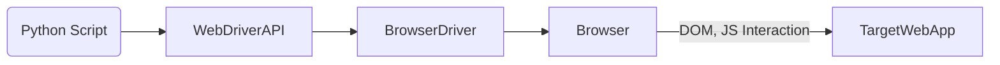
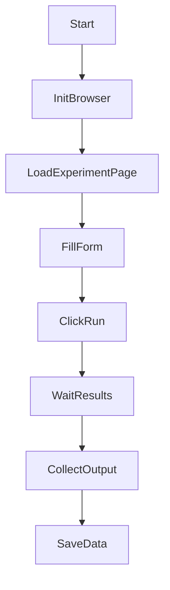

##  Selenium with Python for Experiment Development

**Selenium** is a powerful automation framework that allows programmatic control over web browsers. In experimental development, it is widely used for:

- Automating web-based tasks
- Collecting data or scraping
- UI-based testing of web experiments
- Simulating user interactions

---

## Design Philosophy

| Principle           | Description                                                                 |
|---------------------|-----------------------------------------------------------------------------|
| **Automation-First** | Designed to mimic human actions on browsers programmatically.              |
| **Cross-browser**    | Supports Chrome, Firefox, Edge, Safari, etc.                              |
| **Language Neutral** | Works with Python, Java, C#, etc.                                          |
| **WebDriver Model**  | Uses the WebDriver protocol to control browser behavior in real-time.      |
| **Test-Oriented**    | Primarily designed for functional testing of web applications.             |

---

## Selenium Architecture



| Component         | Role                                                                 |
|------------------|----------------------------------------------------------------------|
| **Python Script** | Your experimental logic or test scenario.                           |
| **WebDriver API** | Interface that translates Python commands to WebDriver protocol.    |
| **BrowserDriver** | Binary that communicates with the actual browser (e.g., chromedriver). |
| **Browser**       | Chrome, Firefox, etc., where automation occurs.                     |
| **Target Web App**| The site or system under test.                                      |

---

## Core Components in Exp Dev Context

| Component             | Description                                                                 |
|-----------------------|-----------------------------------------------------------------------------|
| **webdriver**         | Launch and control a browser instance (e.g., `webdriver.Chrome()`).          |
| **find_element(s)**   | Locate page elements by tag, class, id, XPath, etc.                         |
| **Actions (click, send_keys)**| Simulate interactions such as typing, clicking, scrolling.     |
| **Explicit Waits**    | Synchronize with dynamic pages or JavaScript.                              |
| **Screenshots & Logs**| Capture result states or errors visually/textually.                        |
| **Headless Mode**     | Run browser in background for large-scale data collection or CI.            |

---

## Applications in Experiment Development

| Use Case                  | Description                                                               |
|---------------------------|---------------------------------------------------------------------------|
| **Web Data Collection**    | Automatically collect web-based experimental data.                        |
| **Form Submission**        | Simulate user input for surveys, A/B tests, or parameter testing.         |
| **UI Testing**             | Validate frontend behavior during development.                            |
| **Experiment Automation**  | Schedule repetitive browser-based runs for result collection.             |
| **ML/AI Benchmark UI**     | Automate test runs of deployed models (e.g., through Flask frontends).    |

---

## Sample Workflow for Experiment Automation



---

## Typical Python Script for Experiments

```python
from selenium import webdriver
from selenium.webdriver.common.by import By
from selenium.webdriver.chrome.options import Options

# Set up headless mode for batch runs
options = Options()
options.headless = True
driver = webdriver.Chrome(options=options)

driver.get("http://localhost:5000/experiment")

# Input parameters and submit
driver.find_element(By.ID, "param1").send_keys("42")
driver.find_element(By.ID, "submit").click()

# Wait and collect result
result = driver.find_element(By.ID, "output").text
print("Result:", result)
driver.quit()
```

---

## Features for Experimental Dev

| Feature           | Benefit                                                                 |
|-------------------|------------------------------------------------------------------------|
| **Headless Mode** | Fast, resource-efficient batch automation.                             |
| **Waits**         | Ensures experiments finish before scraping results.                    |
| **Element Locators** | Fine-grained control to access or manipulate any UI element.       |
| **Logging**       | Record results or failure diagnostics.                                 |
| **Screenshot Capture** | Save result screens for verification.                           |
| **File Download Handling** | Automate downloading CSVs, charts, images.                  |

---

##  Best Practices for Exp Dev

- Use `WebDriverWait` to handle delays.
- Use headless mode to scale runs.
- Parameterize scripts for batch experimentation.
- Save outputs programmatically (logs, files, screenshots).
- Use `try/except` to catch unexpected DOM failures.

---

## Folder Structure Suggestion

```
/exp_automation
├── run_experiment.py
├── /results           # Text, screenshots, CSV outputs
├── /drivers           # Browser drivers like chromedriver
└── config.yaml        # Experiment input parameters
```

---

## Summary

| Advantage               | Description                                        |
|-------------------------|----------------------------------------------------|
| Automates full browser logic | Simulates real user interaction with pages |
| Ideal for repetitive tasks | Perfect for batch tests or auto data extraction |
| Easy to integrate with Python stack | Works with Pandas, NumPy, etc.        |
| Scalable                | Supports headless, parallel, and CI/CD usage      |

---
