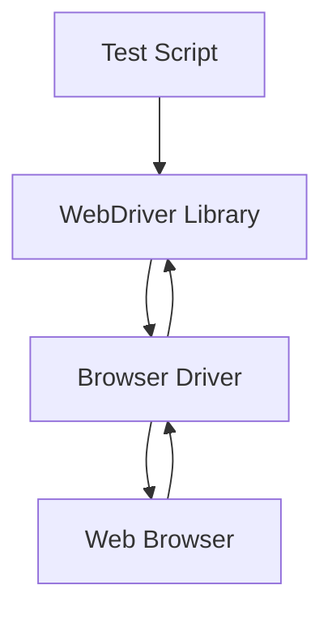

## Selenium 

---

### What is Selenium?

Selenium is an **open-source automated testing framework** designed for **web applications**. It allows testers to simulate user interactions like clicking, typing, scrolling, and navigation in browsers. It supports automation across **different browsers, operating systems, and languages**.

---

### Key Features

* **Cross-browser** and **cross-platform** support
* **Language-independent** API bindings (Java, Python, C#, JavaScript, Ruby, Kotlin, etc.)
* Integration with **CI/CD tools**
* Supports **parallel execution** via Grid
* Enables **UI automation**, **regression testing**, and **functional testing**

---

### Selenium Ecosystem Components

| Component              | Purpose                                                                |
| ---------------------- | ---------------------------------------------------------------------- |
| **Selenium WebDriver** | Core library for browser automation. Communicates with browser drivers |
| **Selenium IDE**       | Record-and-play tool for beginners. No code required                   |
| **Selenium Grid**      | Executes tests across multiple systems/environments in parallel        |
| **Selenium Manager**   | Automatically manages browser driver binaries                          |

---

### WebDriver Architecture

1. **Test Script (Client Code)**: Written in a supported language using WebDriver APIs
2. **WebDriver API**: Language-specific bindings for test commands
3. **Browser Driver**: Accepts WebDriver commands and communicates with the browser
4. **Web Browser**: Where the test actions are executed

---

### Browser Drivers

| Browser           | Driver         |
| ----------------- | -------------- |
| Chrome            | ChromeDriver   |
| Firefox           | GeckoDriver    |
| Safari            | SafariDriver   |
| Edge              | EdgeDriver     |
| Internet Explorer | IEDriverServer |

All drivers communicate using **W3C WebDriver Protocol**.

---

### Supported Programming Languages

Selenium provides client bindings for:

* **Java**
* **Python**
* **C# (.NET)**
* **JavaScript (Node.js)**
* **Ruby**
* **Kotlin**

Each has its own official WebDriver library.

---

### Selenium Test Lifecycle

---

### Locating Elements (Locator Strategies)

All bindings support these **universal locators**:

* **ID**
* **Name**
* **Class Name**
* **Tag Name**
* **Link Text / Partial Link Text**
* **CSS Selector**
* **XPath**

Each language offers a `By` mechanism or equivalent to access these.

---

### WebDriver Core Actions (Concepts, not Syntax)

| Category        | Common Actions                                 |
| --------------- | ---------------------------------------------- |
| Browser Control | Open URL, Close Browser, Refresh               |
| Navigation      | Back, Forward, Refresh                         |
| Element Actions | Click, Send Keys, Clear, Submit                |
| Alerts          | Accept, Dismiss, Get Text, Send Input          |
| Frames/Windows  | Switch to Frame, Switch to Window, Handle Tabs |
| Cookies         | Get, Add, Delete                               |

---

### Waits

Waits are used to handle dynamic page loads and delays.

| Wait Type         | Behavior                         |
| ----------------- | -------------------------------- |
| **Implicit Wait** | Waits globally for all elements  |
| **Explicit Wait** | Waits for specific condition     |
| **Fluent Wait**   | Polls at intervals with timeouts |

---

### Selenium Grid

| Feature                | Description                                           |
| ---------------------- | ----------------------------------------------------- |
| **Hub**                | Central controller to distribute tests                |
| **Node**               | Machine that executes tests on a specific environment |
| **Parallel Execution** | Run tests on different OS/browser combos at once      |
| **Docker Support**     | Selenium Grid can be deployed using containers        |

---

### Selenium IDE

* **GUI-based tool** for recording and replaying browser actions
* Suitable for **quick prototyping**
* Supports **command exporting** to various languages

---

### Selenium Manager

* **Introduced in Selenium 4.6+**
* Automatically downloads and manages correct driver binaries (e.g., ChromeDriver)
* Eliminates need to manually handle driver paths

---

### Integration Capabilities

| Integration Type | Tools/Options                              |
| ---------------- | ------------------------------------------ |
| Test Frameworks  | JUnit, TestNG, PyTest, NUnit, Mocha, RSpec |
| Reporting Tools  | Allure, Extent Reports, custom logs        |
| Build Tools      | Maven, Gradle, MSBuild                     |
| CI/CD            | Jenkins, GitHub Actions, GitLab CI         |
| Cloud Testing    | BrowserStack, Sauce Labs, LambdaTest       |

---

### Advantages

* Open-source and actively maintained
* Flexible with multiple languages
* Cross-browser and cross-platform compatibility
* Integration with many tools in the testing ecosystem
* Good for both simple and complex test scenarios

---

### Limitations

* Only supports **web applications** (no mobile/desktop)
* No built-in reporting mechanism
* May require frequent maintenance for dynamic UIs
* Test flakiness can occur without proper waits and design

---

### Alternatives to Selenium

| Tool           | Features                                                                     |
| -------------- | ---------------------------------------------------------------------------- |
| **Playwright** | Modern automation tool, supports browser context, great for parallel testing |
| **Cypress**    | Frontend-focused testing framework, easy setup, fast                         |
| **Puppeteer**  | Headless Chrome/Firefox automation for Node.js                               |
| **TestCafe**   | Easy JavaScript-based testing                                                |

---
