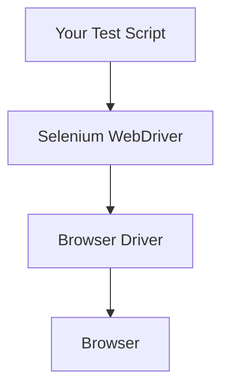

## Overview of Selenium

### 🧩 What is Selenium?
Selenium is an open-source **automated testing framework** for web applications. It allows developers and testers to simulate user actions like clicking buttons, filling forms, or navigating web pages—just as a real user would do in a browser.

---

### 🧠 Philosophy
Selenium is designed to:
- Automate browsers across different platforms.
- Support a variety of programming languages.
- Enable robust and repeatable browser-based regression testing.

---

### 🧱 Components

| Component        | Description |
|------------------|-------------|
| **Selenium WebDriver** | Core component to interact with browsers using native automation. |
| **Selenium IDE** | Record-and-playback tool for creating simple test scripts quickly. |
| **Selenium Grid** | Distributes tests across multiple machines/browsers for parallel execution. |
| **Selenium RC** *(deprecated)* | Older version replaced by WebDriver. |

---

### 🔁 How It Works

- **WebDriver** communicates directly with the browser using browser-specific drivers.
- It sends commands like `click`, `get`, `sendKeys`, which the browser executes.
- WebDriver then fetches responses and returns results back to your script.

```plaintext
Your Code → WebDriver API → Browser Driver → Real Browser
```

---

### 🧰 Supported Languages
- Java
- Python
- C#
- Ruby
- JavaScript (Node.js)
- Kotlin (unofficial support)

---

### 🌐 Supported Browsers

| Browser       | Driver Used          |
|---------------|----------------------|
| Chrome        | ChromeDriver         |
| Firefox       | GeckoDriver          |
| Edge          | EdgeDriver           |
| Safari        | safaridriver         |
| Opera         | Operadriver (less used) |

---

### 📌 Key Features
- Cross-browser testing
- Parallel test execution (via Grid)
- Integration with CI/CD tools (e.g., Jenkins, GitHub Actions)
- Supports headless testing
- Flexible locator strategies (XPath, CSS Selector, ID, etc.)

---

### 🧪 Common Use Cases
- Regression Testing
- Smoke/Sanity Testing
- UI Testing
- Web Scraping *(though not its original intent)*

---

### 🧱 Architecture Diagram (Mermaid)



---
