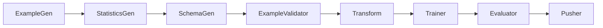

# Architecture

---

## High-Level Architecture Overview

TensorFlow's architecture is built to support **flexible, efficient computation** across heterogeneous environments (CPUs, GPUs, TPUs) and **scalable execution** in production or research.

---

## Layered View of TensorFlow Architecture

```mermaid
flowchart TD
    A[User Code (Python)] --> B[TensorFlow API]
    B --> C[Backend Execution Engine]
    C --> D[Device Abstraction Layer]
    D --> E1[CPU]
    D --> E2[GPU]
    D --> E3[TPU]
```

---

## Architectural Layers

### 1. **Frontend Layer (Python API)**

* Interface for building models and defining computations.
* Major APIs:

  * `tf.keras`
  * `tf.data`
  * `tf.function`
  * `tf.distribute`
* Provides high-level and low-level abstractions.

---

### 2. **Core Runtime (Execution Engine)**

* Converts Python-defined operations into **computational graphs**.
* Optimizes graph for speed, memory, and parallelism.
* Responsible for:

  * Auto-differentiation (using `tf.GradientTape`)
  * Graph execution (`tf.function`)
  * Scheduling ops to devices
  * Managing memory allocation

---

### 3. **TensorFlow Graph (Dataflow Graph)**

* Internal representation of computations.
* Nodes: operations (e.g., matrix multiplication)
* Edges: tensors flowing between operations
* Benefits:

  * Device placement optimization
  * Efficient serialization
  * Parallel execution

---

### 4. **Device Abstraction Layer**

* Maps graph operations to specific devices:

  * CPU
  * GPU (via CUDA/cuDNN)
  * TPU (Tensor Processing Units)
* Handles:

  * Kernel registration
  * Memory allocation
  * Transfer of data between devices

---

### 5. **Hardware Layer**

* Executes compiled operations on physical devices.
* Supports multi-device and distributed execution.
* TensorFlow dynamically places operations based on available devices and resource constraints.

---

## Eager vs Graph Execution

| Mode            | Description                                     |
| --------------- | ----------------------------------------------- |
| Eager Execution | Immediate execution (imperative, Python-native) |
| Graph Execution | Compiled, optimized static graph execution      |

Graph execution is triggered using `@tf.function` in TensorFlow 2.x.

---

## Distributed Architecture

TensorFlow supports **distributed training** using the `tf.distribute` API.

### Components:

* **Cluster**: Group of machines (workers, parameter servers)
* **Tasks**: Processes that run on each machine
* **Strategy**:

  * `MirroredStrategy` (multi-GPU)
  * `MultiWorkerMirroredStrategy` (multi-machine)
  * `TPUStrategy` (TPU pods)

---

## TensorFlow Extended (TFX) Architecture for Production ML



* **ExampleGen**: Ingests data
* **Transform**: Feature engineering
* **Trainer**: Model training using TensorFlow
* **Evaluator**: Model validation
* **Pusher**: Deploys model to serving infrastructure

---

## Summary of Key Architectural Goals

| Goal                 | Achieved Through                           |
| -------------------- | ------------------------------------------ |
| Portability          | Dataflow graphs and SavedModel format      |
| Performance          | Graph optimization and device placement    |
| Scalability          | `tf.distribute` and multi-device execution |
| Flexibility          | Hybrid eager and graph execution           |
| Deployment-readiness | TensorFlow Serving, Lite, JS, and TFX      |

---
