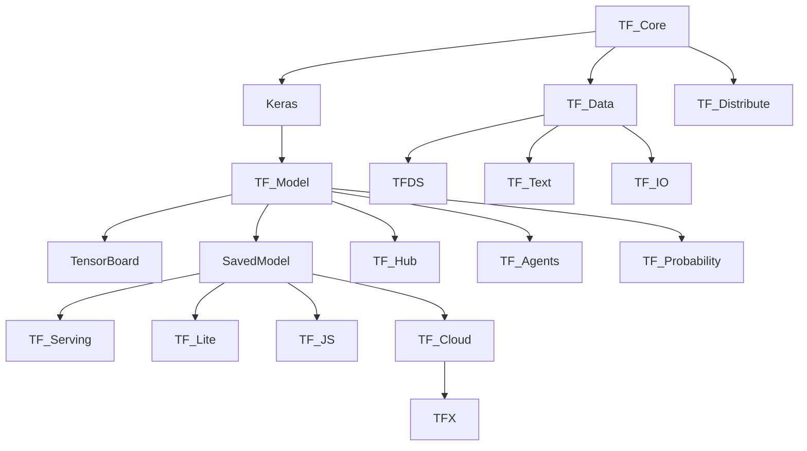

# The Ecosystem

---

The **TensorFlow ecosystem** includes a broad collection of libraries, tools, platforms, and extensions that support the **end-to-end machine learning workflow**: from data prep and model building to deployment and monitoring.

---

## Core Ecosystem Components

| Component                 | Purpose                              | Description                        |
| ------------------------- | ------------------------------------ | ---------------------------------- |
| **TensorFlow Core**       | Low-level API for building ML models | Foundation for all TF features     |
| **Keras (tf.keras)**      | High-level API for rapid prototyping | Integrated into TensorFlow         |
| **TF Lite**               | Mobile and embedded deployment       | Optimize models for edge devices   |
| **TF.js**                 | ML in the browser and JavaScript     | Web deployment of models           |
| **TensorFlow Serving**    | Model deployment via REST/gRPC       | Production-grade serving solution  |
| **TF Hub**                | Reusable pretrained model repository | For transfer learning              |
| **TF Datasets (TFDS)**    | Standard ML datasets                 | Easily load, preprocess datasets   |
| **TF Text**               | NLP preprocessing                    | Tokenization, normalization tools  |
| **TF Addons**             | Extra ML tools (optimizers, metrics) | Community-contributed              |
| **TF Agents**             | Reinforcement learning framework     | Modular RL components              |
| **TF Probability**        | Probabilistic modeling               | Bayesian statistics, distributions |
| **TF Model Optimization** | Quantization/pruning for efficiency  | Speed up, shrink models            |
| **TFX (Extended)**        | ML pipeline for production           | Workflow orchestration             |
| **TF Cloud**              | Training on Google Cloud             | GCP integration for scalability    |
| **TensorBoard**           | Visualization and debugging          | Track metrics, inspect models      |
| **TF Decision Forests**   | Decision tree & random forest models | Non-neural approaches in TF        |

---

## 1. **Model Development & Training**

* **tf.keras** – High-level API for model creation, training, and evaluation.
* **TF Core API** – Low-level control for custom model logic.
* **TF Data** – Build efficient input pipelines.
* **TF Distribute** – Scalable multi-GPU/TPU training.

---

## 2. **Data Handling & Processing**

* **tf.data** – Input pipeline API.
* **TFDS (TensorFlow Datasets)** – Preloaded datasets.
* **TF Text** – Tools for tokenization, splitting, stemming.
* **TF IO** – Interface with data formats like Parquet, AVRO, etc.

---

## 3. **Model Deployment**

| Target       | Tool                  | Notes                                  |
| ------------ | --------------------- | -------------------------------------- |
| Server/API   | TensorFlow Serving    | REST/gRPC API                          |
| Mobile       | TensorFlow Lite       | Quantized models                       |
| Web          | TensorFlow\.js        | Run models in browsers                 |
| Embedded/IoT | TFLite Micro          | Extremely resource-constrained devices |
| Cloud        | TensorFlow Cloud, TFX | GCP & pipelines                        |

---

## 4. **Transfer Learning & Reusability**

* **TF Hub**:

  * Pretrained models for vision, NLP, etc.
  * Easy to plug into new models.

```python
import tensorflow_hub as hub
model = tf.keras.Sequential([
    hub.KerasLayer("https://tfhub.dev/google/imagenet/mobilenet_v2_100_224/classification/5")
])
```

---

## 5. **Reinforcement Learning**

* **TF Agents**:

  * Modular framework for RL environments, policies, and training loops.
  * Supports DQN, PPO, A3C, etc.

---

## 6. **Probabilistic Programming**

* **TF Probability**:

  * Probabilistic layers, distributions
  * Variational inference, Monte Carlo methods

---

## 7. **Model Optimization**

* **TF Model Optimization Toolkit**:

  * Pruning
  * Post-training quantization
  * Clustered weights

Useful for compressing and speeding up models before deployment.

---

## 8. **Visualization & Monitoring**

* **TensorBoard**:

  * Track training metrics
  * Inspect model graph
  * View distributions, histograms, images, and embeddings

---

## 9. **Pipelines & MLOps**

* **TFX (TensorFlow Extended)**:

  * Production ML pipelines
  * Data ingestion → Validation → Training → Serving
* Components:

  * `ExampleGen`, `Transform`, `Trainer`, `Evaluator`, `Pusher`
* Orchestrators:

  * Airflow, Kubeflow, Apache Beam

---

## 10. **Third-Party & Community Tools**

| Tool                    | Use Case                                   |
| ----------------------- | ------------------------------------------ |
| **TF Addons**           | Extra layers, metrics, losses              |
| **TF Cloud**            | Seamless training on GCP                   |
| **TF Quantum**          | Quantum machine learning                   |
| **TF Federated**        | Federated learning (privacy-focused)       |
| **TF Lite Model Maker** | Auto-convert & fine-tune models for mobile |

---

## Ecosystem Architecture Diagram (Textual)



---

## Summary Table

| Category               | Tool/Library                     | Purpose                             |
| ---------------------- | -------------------------------- | ----------------------------------- |
| Core API               | `tf`, `tf.keras`                 | Model building and training         |
| Data                   | `tf.data`, `TFDS`                | Efficient data pipelines            |
| Visualization          | `TensorBoard`                    | Metric & model graph monitoring     |
| Deployment             | `TF Serving`, `TF Lite`, `TF.js` | Model serving on various platforms  |
| Transfer Learning      | `TF Hub`                         | Reuse pretrained models             |
| Optimization           | `TF Model Optimization`          | Reduce model size/performance boost |
| Pipelines (MLOps)      | `TFX`                            | Full ML workflow automation         |
| Reinforcement Learning | `TF Agents`                      | RL training pipelines               |
| Probabilistic ML       | `TF Probability`                 | Bayesian modeling                   |
| Mobile/Embedded        | `TFLite`, `TFLite Micro`         | Mobile & low-resource devices       |
| Web                    | `TF.js`                          | ML in browser with JavaScript       |
| Distributed            | `TF Distribute`, `TF Cloud`      | Scale training                      |

---
