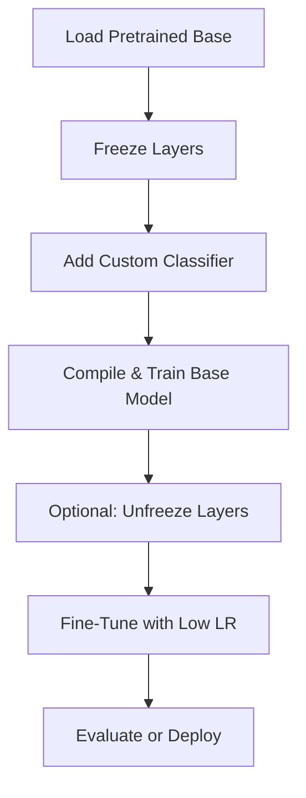

# Transfer Learning

---

## What Is Transfer Learning?

**Transfer Learning** is a machine learning technique where a **pretrained model** (usually on a large dataset like ImageNet) is used as the **starting point** for a new task.

It is especially useful when:

* You have limited data for your task.
* The new task shares characteristics with the source task.

---

## Approaches in TensorFlow

| Strategy               | Description                                        | Example Use Case                   |
| ---------------------- | -------------------------------------------------- | ---------------------------------- |
| **Feature Extraction** | Use pretrained model as a frozen feature extractor | Small dataset; prevent overfitting |
| **Fine-Tuning**        | Unfreeze some or all layers to train further       | Improve accuracy on new domain     |

---

## Common Workflow in TensorFlow

### Step 1: Load Pretrained Base

```python
base_model = tf.keras.applications.MobileNetV2(
    input_shape=(224, 224, 3),
    include_top=False,   # Exclude final classification layer
    weights='imagenet'   # Load pretrained weights
)
```

### Step 2: Freeze Base Layers

```python
base_model.trainable = False
```

### Step 3: Add Custom Head

```python
inputs = tf.keras.Input(shape=(224, 224, 3))
x = base_model(inputs, training=False)
x = tf.keras.layers.GlobalAveragePooling2D()(x)
x = tf.keras.layers.Dropout(0.2)(x)
outputs = tf.keras.layers.Dense(5, activation='softmax')(x)
model = tf.keras.Model(inputs, outputs)
```

### Step 4: Compile & Train

```python
model.compile(optimizer='adam', loss='sparse_categorical_crossentropy', metrics=['accuracy'])
model.fit(train_data, validation_data=val_data, epochs=10)
```

---

## Fine-Tuning (Optional)

### Step 5: Unfreeze Top Layers

```python
base_model.trainable = True

# Optionally freeze lower layers
for layer in base_model.layers[:100]:
    layer.trainable = False
```

### Step 6: Re-Compile with Lower LR

```python
model.compile(optimizer=tf.keras.optimizers.Adam(1e-5), loss='sparse_categorical_crossentropy', metrics=['accuracy'])
model.fit(train_data, validation_data=val_data, epochs=5)
```

---

## Popular Pretrained Models in `tf.keras.applications`

| Model          | Strength                           | Input Size |
| -------------- | ---------------------------------- | ---------- |
| `MobileNetV2`  | Lightweight, fast                  | 224×224    |
| `EfficientNet` | Best accuracy/efficiency trade-off | 224×224+   |
| `ResNet50`     | Deeper model, good generalization  | 224×224    |
| `InceptionV3`  | Multi-scale features               | 299×299    |
| `Xception`     | High performance, slower           | 299×299    |
| `DenseNet`     | Compact and accurate               | 224×224    |

```python
tf.keras.applications.MobileNetV2
tf.keras.applications.EfficientNetB0
tf.keras.applications.ResNet50
```

---

## Image Preprocessing Helpers

Use matching preprocessing for the model:

```python
from tensorflow.keras.applications.mobilenet_v2 import preprocess_input
image = preprocess_input(image)  # Scale/normalize input as expected by model
```

---

## Benefits of Transfer Learning

* Faster convergence
* Reduced overfitting
* Lower compute cost
* Better performance with small data

---

## Custom Dataset Tips

| Scenario                       | Recommendation                              |
| ------------------------------ | ------------------------------------------- |
| Few samples per class          | Use feature extraction only                 |
| Moderate data + compute budget | Fine-tune last few layers                   |
| New task is very different     | Fine-tune more layers or start from scratch |

---

## Summary Workflow



---

## Transfer Learning for Non-Vision Tasks

* **Text**: Use `TF Hub` with BERT, Universal Sentence Encoder.
* **Audio**: Use YAMNet or VGGish for audio feature extraction.
* **Time Series**: Use Conv1D or RNN-based pretrained models (less common).

---
